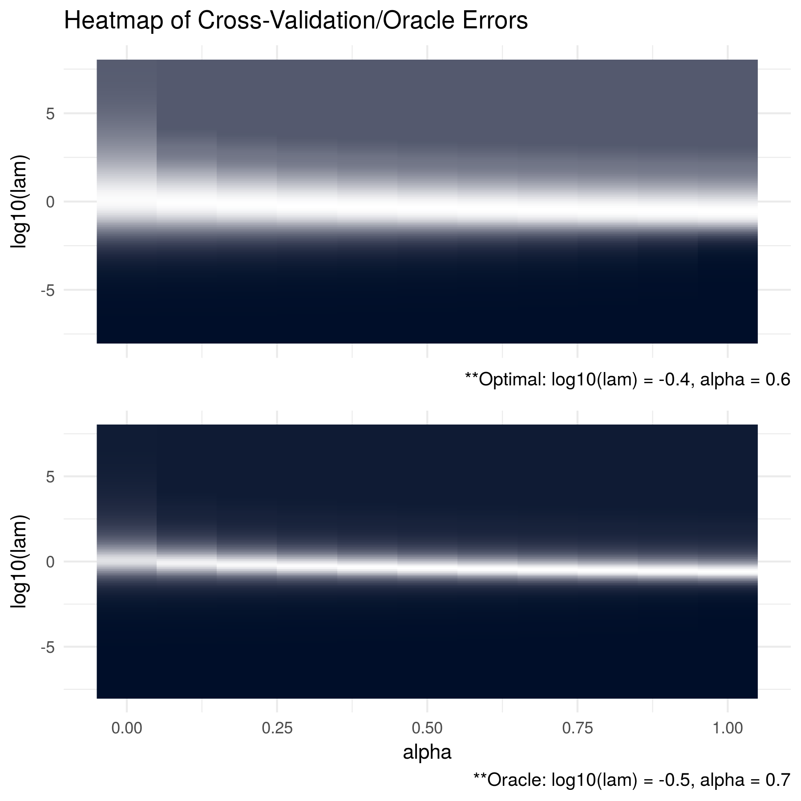

# Precision Matrix Estimation


## Background

Consider the case where we observe $n$ independent, identically distributed copies of the random variable ($X_{i}$) where $X_{i} \in \mathbb{R}^{p}$ is normally distributed with some mean, $\mu$, and some variance, $\Sigma$. That is, $X_{i} \sim N_{p}\left( \mu, \Sigma \right)$.

Because we assume independence, we know that the probability of observing these specific observations $X_{1}, ..., X_{n}$ is equal to

\begin{equation} 
\begin{split}
  f(X_{1}, ..., X_{n}; \mu, \Sigma) &= \prod_{i = 1}^{n}(2\pi)^{-p/2}\left| \Sigma \right|^{-1/2}\exp\left[ -\frac{1}{2}\left( X_{i} - \mu \right)'\Sigma^{-1}\left( X_{i} - \mu \right) \right] \\
  &= (2\pi)^{-nr/2}\left| \Sigma \right|^{-n/2}\mbox{etr}\left[ -\frac{1}{2}\sum_{i = 1}^{n}\left( X_{i} - \mu \right)\left( X_{i} - \mu \right)'\Sigma^{-1} \right]
\end{split}
(\#eq:lik)
\end{equation} 

where $\mbox{etr}\left( \cdot \right)$ denotes the exponential trace operator. It follows that the log-likelihood for $\mu$ and $\Sigma$ is equal to the following:

\begin{equation}
  l(\mu, \Sigma | X) = const. - \frac{n}{2}\log\left| \Sigma \right| - tr\left[ \frac{1}{2}\sum_{i = 1}^{n}\left(X_{i} - \mu \right)\left(X_{i} - \mu \right)'\Sigma^{-1} \right]
(\#eq:loglik)
\end{equation}

If we are interested in estimating $\mu$, it is relatively straight forward to show that the maximum likelihood estimator (MLE) for $\mu$ is $\hat{\mu}_{MLE} = \sum_{i = 1}^{n}X_{i}/n$ which we typically denote as $\bar{X}$. However, in addition to $\mu$, many applications require the estimation of $\Sigma$ as well. We can also find a maximum likelihood estimator:

\begin{equation}
\hat{\Sigma}^{mle} = \arg\max_{\Sigma \in \mathbb{S}_{+}^{p}}\left\{ const. - \frac{n}{2}\log\left| \Sigma \right| - tr\left[ \frac{1}{2}\sum_{i = 1}^{n}\left(X_{i} - \mu \right)\left(X_{i} - \mu \right)'\Sigma^{-1} \right] \right\}
(\#eq:sigmaloglik)
\end{equation}

\begin{equation}
\nabla_{\Sigma}l(\mu, \Sigma | X) = -\frac{n}{2}\Sigma^{-1} + \frac{1}{2}\sum_{i = 1}^{n}\left(X_{i} - \mu \right)\left(X_{i} - \mu \right)'\Sigma^{-2}
(\#eq:nablasigma)
\end{equation}

\begin{equation}
\Rightarrow \hat{\Sigma}^{mle} = \left[ \frac{1}{n}\sum_{i = 1}^{n}\left(X_{i} - \bar{X} \right)\left(X_{i} - \bar{X} \right)' \right]
(\#eq:sigmamle)
\end{equation}

By setting the gradient equal to zero and plugging in the MLE for $\mu$, we find that the MLE for $\Sigma$ is our usual sample estimator often denoted as $S$. It turns out that we could have just as easily computed the maximum likelihood estimator for the precision matrix $\Omega \equiv \Sigma^{-1}$ and taken its inverse:

\begin{equation}
\hat{\Omega}^{mle} = \arg\min_{\Omega \in S_{+}^{p}}\left\{ tr\left(S\Omega\right) - \log\left|\Omega\right| \right\}
(\#eq:omegamle)
\end{equation}

so that $\hat{\Omega}_{MLE} = S^{-1}$. Beyond the formatting convenience, computing estimates for $\Omega$ as opposed to $\Sigma$ often poses less computational challenges -- and accordingly, the literature has placed more emphasis on efficiently solving for $\Omega$ instead of $\Sigma$ ^[Notice that here we are *minimizing* the negative log-likelihood as opposed to maximizing the log-likelihood. Both procedures will result in the same estimate.].

As in regression settings, we can construct a *penalized* log-likelihood estimator by adding a penalty term, $P\left(\Omega\right)$, to the log-likelihood so that

\begin{equation}
\hat{\Omega} = \arg\min_{\Omega \in S_{+}^{p}}\left\{ tr\left(S\Omega\right) - \log\left|\Omega \right| + P\left( \Omega \right) \right\}
(\#eq:omegapen)
\end{equation}

$P\left( \Omega \right)$ is often of the form $P\left(\Omega \right) = \lambda\|\Omega \|_{F}^{2}/2$ or $P\left(\Omega \right) = \|\Omega\|_{1}$ where $\lambda > 0$, $\left\|\cdot \right\|_{F}^{2}$ is the Frobenius norm and we define $\left\|A \right\|_{1} = \sum_{i, j} \left| A_{ij} \right|$. These penalties are the ridge and lasso, respectively. In the `ADMMsigma` package, we instead take

\begin{equation}
P\left( \Omega \right) = \lambda\left[\frac{1 - \alpha}{2}\left\| \Omega \right|_{F}^{2} + \alpha\left\| \Omega \right\|_{1} \right]
(\#eq:pen)
\end{equation}

so that solving the full penalized log-likelihood for $\Omega$ results in solving

\begin{equation}
\hat{\Omega} = \arg\min_{\Omega \in S_{+}^{p}}\left\{ tr\left(S\Omega\right) - \log\left|\Omega \right| + \lambda\left[\frac{1 - \alpha}{2}\left\| \Omega \right|_{F}^{2} + \alpha\left\| \Omega \right\|_{1} \right] \right\}
(\#eq:omegaloglik)
\end{equation}

where $0 \leq \alpha \leq 1$. This penalty, know as the *elastic-net* penalty, was explored by Hui Zou and Trevor Hastie [@zou2005regularization] and is identical to the penalty used in the popular penalized regression package `glmnet`. Clearly, when $\alpha = 0$ the elastic-net reduces to a ridge-type penalty and when $\alpha = 1$ it reduces to a lasso-type penalty. Having this flexibility and generalization allows us to perform cross validation across proposed $\alpha$ values in addition to proposed $\lambda$ values.

The penalty proposed by @molstad2017shrinking is one of the following form:

\begin{equation}
P\left(\Omega\right) = \lambda\left\| A\Omega B - C \right\|_{1}
(\#eq:pen2)
\end{equation}

where $A \in \mathbb{R}^{m \times p}, B \in \mathbb{R}^{p \times q}, \mbox{ and } C \in \mathbb{R}^{m \times q}$ are matrices assumed to be known and specified by the user. Solving the full penalized log-likelihood for $\Omega$ results in solving

\begin{equation}
\hat{\Omega} = \arg\min_{\Omega \in S_{+}^{p}}\left\{ tr\left(S\Omega\right) - \log\left|\Omega \right| + \lambda\left\| A\Omega B - C \right\|_{1} \right\}
(\#eq:omegaloglik2)
\end{equation}

This form of penalty is particularly useful because matrices $A, B, \mbox{ and } C$ can be constructed so that we penalize the sum, absolute value of a *characteristic* of the precision matrix $\Omega$. This type of penalty leads to many new, interesting, and novel estimators for $\Omega$. An example of one such estimator (suppose we observe $n$ samples of $Y_{i} \in \mathbb{R}^{r}$) would be one where we set $A = I_{p}, B = \Sigma_{xy}, \mbox{ and } C = 0$ where $\Sigma_{xy}$ is the covariance matrix of $X$ and $Y$. This penalty has the effect of assuming sparsity in the forward regression coefficient $\beta \equiv \Omega\Sigma_{xy}$. Of course, in practice we do not know the true covariance matrix $\Sigma_{xy}$ but we might consider using the sample estimate $\hat{\Sigma}_{xy} = \sum_{i = 1}^{n}\left(X_{i} - \bar{X}\right)\left(Y_{i} - \bar{Y}\right)^{T}/n$

We will explore how to solve for $\hat{\Omega}$ in the next section.


## ADMM algorithm

Many efficient methods have been proposed to solve for $\hat{\Omega}$ when $\alpha = 1$. The most popular method is the graphical lasso algorithm (glasso) introduced by @friedman2008sparse. However, no methods (to the best of my knowledge) have estimated $\Omega$ when $\alpha \in (0, 1)$. We will use the alternating direction method of multipliers (ADMM) algorithm to do so.

As the authors state in @boyd2011distributed, the "ADMM is an algorithm that is intended to blend the decomposability of dual ascent with the superior convergence properties of the method of multipliers." For our purposes, we will only focus on the ADMM algorithm but it is encouraged to read the original text from Boyd and others for a complete introduction to the other two methods.

In general, suppose we want to solve an optimization problem of the following form:

\begin{equation}
\begin{split}
  \mbox{minimize } f(x) + g(z) \\
  \mbox{subject to } Ax + Bz = c
\end{split}
\end{equation}

where $x \in \mathbb{R}^{n}, z \in \mathbb{R}^{m}, A \in \mathbb{R}^{p \times n}, B \in \mathbb{R}^{p \times m}$, $c \in \mathbb{R}^{p}$, and $f$ and $g$ are assumed to be convex functions (following @boyd2011distributed, the estimation procedure will be introduced in vector form though we could just as easily take $x$ and $z$ to be matrices). In addition to penalized precision matrix estimation, optimization problems like this arise naturally in several statistics and machine learning applications -- particularly regularization methods. For instance, we could take $f$ to be the squared error loss, $g$ to be the $l_{2}$-norm, $c$ to be equal to zero and $A$ and $B$ to be identity matrices to solve the ridge regression optimization problem. In all cases, our goal is to find $x^{*} \in \mathbb{R}^{n}$ and $z^{*} \in \mathbb{R}^{m}$ that achieves the infimum $p^{*}$:

\[ p^{*} = inf\left\{ f(x) + g(z) | Ax + Bz = c \right\} \]

To do so, the ADMM algorithm uses the *augmented lagrangian*

\begin{equation}
L_{\rho}(x, z, y) = f(x) + g(z) + y'(Ax + Bz - c) + \frac{\rho}{2}\left\| Ax + Bz - c \right\|_{2}^{2}
(\#eq:auglagrange)
\end{equation}

where $y \in \mathbb{R}^{p}$ is the lagrange multiplier and $\rho > 0$ is a scalar. Clearly any minimizer, $p^{*}$, under the augmented lagrangian is equivalent to that of the lagrangian since any feasible point $(x, z)$ satisfies the constraint $\rho\left\| Ax + Bz - c \right\|_{2}^{2}/2 = 0$.

The algorithm consists of the following repeated iterations:

\begin{align}
  x^{k + 1} &= \arg\min_{x \in \mathbb{R}^{n}}L_{\rho}(x, z^{k}, y^{k}) (\#eq:xauglagrange) \\
  z^{k + 1} &= \arg\min_{z \in \mathbb{R}^{m}}L_{\rho}(x^{k + 1}, z, y^{k}) (\#eq:zauglagrange) \\
  y^{k + 1} &= y^{k} + \rho(Ax^{k + 1} + Bz^{k + 1} - c) (\#eq:yauglagrange)
\end{align}

In the context of precision matrix estimation, we can let $f$ be equal to the non-penalized likelihood, $g$ be equal to $P\left( \Omega \right)$, and use the constraint $\Omega$ equal to some $Z$ so that the lagrangian is

\begin{equation}
L_{\rho}(\Omega, Z, \Lambda) = f\left(\Omega\right) + g\left(Z\right) + tr\left[\Lambda\left(\Omega - Z\right)\right]
(\#eq:lagrange)
\end{equation}

and the augmented lagrangian is

\begin{equation}
L_{\rho}(\Omega, Z, \Lambda) = f\left(\Omega\right) + g\left(Z\right) + tr\left[\Lambda\left(\Omega - Z\right)\right] + \frac{\rho}{2}\left\|\Omega - Z\right\|_{F}^{2}
(\#eq:auglagrangian)
\end{equation}


The ADMM algorithm is now the following:

\begin{align}
  \Omega^{k + 1} &= \arg\min_{\Omega \in \mathbb{S}_{+}^{p}}\left\{ tr\left(S\Omega\right) - \log\left|\Omega\right| + tr\left[\Lambda^{k}\left(\Omega - Z^{k}\right)\right] + \frac{\rho}{2}\left\| \Omega - Z^{k} \right\|_{F}^{2} \right\} (\#eq:omegaauglagrange) \\
  Z^{k + 1} &= \arg\min_{Z \in \mathbb{S}^{p}}\left\{ \lambda\left[ \frac{1 - \alpha}{2}\left\| Z \right\|_{F}^{2} + \alpha\left\| Z \right\|_{1} \right] + tr\left[\Lambda^{k}\left(\Omega^{k + 1} - Z\right)\right] + \frac{\rho}{2}\left\| \Omega^{k + 1} - Z \right\|_{F}^{2} \right\} (\#eq:ZZauglagrange) \\
  \Lambda^{k + 1} &= \Lambda^{k} + \rho\left( \Omega^{k + 1} - Z^{k + 1} \right) (\#eq:lamauglagrange)
\end{align}


### Algorithm

Set $k = 0$ and initialize $Z^{0}, \Lambda^{0}$, and $\rho$. Repeat steps 1-3 until convergence:

1. Decompose $S + \Lambda^{k} - \rho Z^{k} = VQV'$ via spectral decomposition.

\begin{equation}
\Omega^{k + 1} = \frac{1}{2\rho}V\left[ -Q + \left( Q^{2} + 4\rho I_{p} \right)^{1/2} \right]V'
(\#eq:omegaalgo)
\end{equation}

2. Elementwise soft-thresholding for all $i = 1,..., p$ and $j = 1,..., p$.

\begin{equation}
\begin{split}
Z_{ij}^{k + 1} &= \frac{1}{\lambda(1 - \alpha) + \rho}\mbox{sign}\left(\rho\Omega_{ij}^{k + 1} + \Lambda_{ij}^{k}\right)\left( \left| \rho\Omega_{ij}^{k + 1} + \Lambda_{ij}^{k} \right| - \lambda\alpha \right)_{+} \\
&= \frac{1}{\lambda(1 - \alpha) + \rho}\mbox{soft}\left(\rho\Omega_{ij}^{k + 1} + \Lambda_{ij}^{k}, \lambda\alpha\right)
(\#eq:ZZalgo)
\end{split}
\end{equation}

3. Update $\Lambda^{k + 1}$.

\begin{equation}
\Lambda^{k + 1} = \Lambda^{k} + \rho\left( \Omega^{k + 1} - Z^{k + 1} \right)
(\#eq:lamalgo)
\end{equation}

where $\mbox{soft}(a, b) = \mbox{sign}(a)(\left| a \right| - b)_{+}$.


### Scaled-Form ADMM

There is another popular, alternate form of the ADMM algorithm used by scaling the dual variable ($\Lambda^{k}$). Let us define $R^{k} = \Omega - Z^{k}$ and $U^{k} = \Lambda^{k}/\rho$.

\begin{equation}
\begin{split}
  tr\left[ \Lambda^{k}\left( \Omega - Z^{k} \right) \right] + \frac{\rho}{2}\left\| \Omega - Z^{k} \right\|_{F}^{2} &= tr\left[ \Lambda^{k}R^{k} \right] + \frac{\rho}{2}\left\| R^{k} \right\|_{F}^{2} \\
  &= \frac{\rho}{2}\left\| R^{k} + \Lambda^{k}/\rho \right\|_{F}^{2} - \frac{\rho}{2}\left\| \Lambda^{k}/\rho \right\|_{F}^{2} \\
  &= \frac{\rho}{2}\left\| R^{k} + U^{k} \right\|_{F}^{2} - \frac{\rho}{2}\left\| U^{k} \right\|_{F}^{2}
(\#eq:scaled)
\end{split}
\end{equation}

Therefore, a scaled-form can now be written as

\begin{align}
  \Omega^{k + 1} &= \arg\min_{\Omega \in \mathbb{R}_{+}^{p}}\left\{ tr\left(S\Omega\right) - \log\left|\Omega\right| + \frac{\rho}{2}\left\| \Omega - Z^{k} + U^{k} \right\|_{F}^{2} \right\} (\#eq:omegascaled) \\
  Z^{k + 1} &= \arg\min_{Z \in \mathbb{S}^{p}}\left\{ \lambda\left[ \frac{1 - \alpha}{2}\left\| Z \right\|_{F}^{2} + \alpha\left\| Z \right\|_{1} \right] + \frac{\rho}{2}\left\| \Omega^{k + 1} - Z + U^{k} \right\|_{F}^{2} \right\} (\#eq:ZZscaled) \\
  U^{k + 1} &= U^{k} + \Omega^{k + 1} - Z^{k + 1} (\#eq:Uscaled)
\end{align}

And more generally (in vector form),

\begin{align}
  x^{k + 1} &= \arg\min_{x}\left\{ f(x) + \frac{\rho}{2}\left\| Ax + Bz^{k} - c + u^{k} \right\|_{2}^{2} \right\} (\#eq:xscaled) \\
  z^{k + 1} &= \arg\min_{z}\left\{ g(z) + \frac{\rho}{2}\left\| Ax^{k + 1} + Bz - c + u^{k} \right\|_{2}^{2} \right\} (\#eq:zscaled) \\
  u^{k + 1} &= u^{k} + Ax^{k + 1} + Bz^{k + 1} - c (\#eq:uscaled)
\end{align}

Note that there are limitations to using this method. Because the dual variable is scaled by $\rho$ (the step size), this form limits one to using a constant step size without making further adjustments to $U^{k}$. It has been shown in the literature that a dynamic step size (like the one used in `ADMMsigma`) can significantly reduce the number of iterations required for convergence.


### Stopping Criterion

In discussing the optimality conditions and stopping criterion, we will follow the steps outlined in @boyd2011distributed and cater them to precision matrix estimation.

Below we have three optimality conditions:

1. Primal:

\begin{equation}
\Omega^{k + 1} - Z^{k + 1} = 0
(\#eq:admmprimal)
\end{equation}

2. Dual:

\begin{equation}
\begin{split}
  0 &\in \partial f\left(\Omega^{k + 1}\right) + \Lambda^{k + 1} \\
  0 &\in \partial g\left(Z^{k + 1}\right) - \Lambda^{k + 1}
(\#eq:admmdual)
\end{split}
\end{equation}

The first dual optimality condition is a result of taking the sub-differential of the lagrangian (non-augmented) with respect to $\Omega^{k + 1}$ (note that we must honor the symmetric constraint of $\Omega^{k + 1}$) and the second is a result of taking the sub-differential of the lagrangian with respect to $Z^{k + 1}$ (no symmetric constraint).

We will define the left-hand side of the first condition as the primal residual $r^{k + 1} = \Omega^{k + 1} - Z^{k + 1}$. At convergence, optimality conditions require that $r^{k + 1} \approx 0$. The second residual we will define is the dual residual $s^{k + 1} = \rho\left( Z^{k + 1} - Z^{k} \right)$. This residual is derived from the following:

Because $\Omega^{k + 1}$ is the argument that minimizes $L_{p}\left( \Omega, Z^{k}, \Lambda^{k} \right)$,

\begin{equation}
\begin{split}
  0 &\in \partial \left\{ f\left(\Omega^{k + 1}\right) + tr\left[ \Lambda^{k}\left( \Omega^{k + 1} - Z^{k} \right) \right] + \frac{\rho}{2}\left\| \Omega^{k + 1} - Z^{k} \right\|_{F}^{2} \right\} \\
  &= \partial f\left(\Omega^{k + 1}\right) + \Lambda^{k} + \rho\left(\Omega^{k + 1} - Z^{k}\right) \\
  &= \partial f\left(\Omega^{k + 1}\right) + \Lambda^{k} + \rho\left(\Omega^{k + 1} + Z^{k + 1} - Z^{k + 1} - Z^{k}\right) \\
  &= \partial f\left(\Omega^{k + 1}\right) + \Lambda^{k} + \rho\left(\Omega^{k + 1} - Z^{k + 1}\right) + \rho\left(Z^{k + 1} - Z^{k}\right) \\
  &= \partial f\left(\Omega^{k + 1}\right) + \Lambda^{k + 1} + \rho\left(Z^{k + 1} - Z^{k}\right) \\
  \Rightarrow 0 &\in \rho\left( Z^{k + 1} - Z^{k} \right)
(\#eq:dualresidual)
\end{split}
\end{equation}

Like the primal residual, at convergence optimality conditions require that $s^{k + 1} \approx 0$. Note that the second dual optimality condition is always satisfied:

\begin{equation}
\begin{split}
  0 &\in \partial \left\{ g\left(Z^{k + 1}\right) + tr\left[ \Lambda^{k}\left( \Omega^{k + 1} - Z^{k + 1} \right) \right] + \rho\left\| \Omega^{k + 1} - Z^{k + 1} \right\|_{F}^{2} \right\} \\
  &= \partial g\left(Z^{k + 1}\right) - \Lambda^{k} - \rho\left(\Omega^{k + 1} - Z^{k + 1}\right) \\
  &= \partial g\left(Z^{k + 1}\right) - \Lambda^{k + 1} \\
(\#eq:dualopt)
\end{split}
\end{equation}

One possible stopping criterion is to set $\epsilon^{rel} = \epsilon^{abs} = 10^{-3}$ and stop the algorithm when $\epsilon^{pri} \leq \left\| r^{k + 1} \right\|_{F}$ and $\epsilon^{dual} \leq \left\| s^{k + 1} \right\|_{F}$ where

\begin{equation}
\begin{split}
  \epsilon^{pri} &= p\epsilon^{abs} + \epsilon^{rel}\max\left\{ \left\| \Omega^{k + 1} \right\|_{F}, \left\| Z^{k + 1} \right\|_{F} \right\} \\
  \epsilon^{dual} &= p\epsilon^{abs} + \epsilon^{rel}\left\| \Lambda^{k + 1} \right\|_{F}
(\#eq:admmstopping)
\end{split}
\end{equation}


## Simulations

In the simulations below, we generate data from a number of different oracle precision matrices with various structures. For each data-generating procedure, the `ADMMsigma()` function was run using 5-fold cross validation. After 20 replications, the cross validation errors were totalled and the optimal tuning parameters were selected (results below the top figure). These results are compared with the Kullback Leibler (KL) losses between the estimates and the oracle precision matrix (bottom figure).

We can see below that our cross validation procedure consistently chooses tuning parameters that are close to the optimal parameters with respsect to the oracle.


### Plots

#### Compound Symmetric: P = 100, N = 50

```{r, message = FALSE, echo = TRUE, eval = FALSE}

# oracle precision matrix
Omega = matrix(0.9, ncol = 100, nrow = 100)
diag(Omega = 1)

# generate covariance matrix
S = qr.solve(Omega)

# generate data
Z = matrix(rnorm(100*50), nrow = 50, ncol = 100)
out = eigen(S, symmetric = TRUE)
S.sqrt = out$vectors %*% diag(out$values^0.5) %*% t(out$vectors)
X = Z %*% S.sqrt

```
<br>\vspace{0.5cm}

<!-- <center> -->
<!-- { -->
<!-- width=90% } -->
<!-- </center> -->

```{r admmsim1, eval = T, echo = F, fig.cap = "Figure caption here."}

knitr::include_graphics("images/compound_N50_P100.png")

```

#### Compound Symmetric: P = 10, N = 1000

```{r, message = FALSE, echo = TRUE, eval = FALSE}

# oracle precision matrix
Omega = matrix(0.9, ncol = 10, nrow = 10)
diag(Omega = 1)

# generate covariance matrix
S = qr.solve(Omega)

# generate data
Z = matrix(rnorm(10*1000), nrow = 1000, ncol = 10)
out = eigen(S, symmetric = TRUE)
S.sqrt = out$vectors %*% diag(out$values^0.5) %*% t(out$vectors)
X = Z %*% S.sqrt

```
<br>\vspace{0.5cm}

<!-- <center> -->
<!-- { -->
<!-- width=90% } -->
<!-- </center> -->

```{r admmsim2, eval = T, echo = F, fig.cap = "Figure caption here."}

knitr::include_graphics("images/compound_N1000_P10.png")

```


#### Dense: P = 100, N = 50

```{r, message = FALSE, echo = TRUE, eval = FALSE, tidy = FALSE}

# generate eigen values
eigen = c(rep(1000, 5, rep(1, 100 - 5)))

# randomly generate orthogonal basis (via QR)
Q = matrix(rnorm(100*100), nrow = 100, ncol = 100) %>% qr %>% qr.Q

# generate covariance matrix
S = Q %*% diag(eigen) %*% t(Q)

# generate data
Z = matrix(rnorm(100*50), nrow = 50, ncol = 100)
out = eigen(S, symmetric = TRUE)
S.sqrt = out$vectors %*% diag(out$values^0.5) %*% t(out$vectors)
X = Z %*% S.sqrt

```
<br>\vspace{0.5cm}

<!-- <center> -->
<!-- { -->
<!-- width=90% } -->
<!-- </center> -->
<!-- } -->

```{r admmsim3, eval = T, echo = F, fig.cap = "Figure caption here."}


```


#### Dense: P = 10, N = 50

```{r, message = FALSE, echo = TRUE, eval = FALSE, tidy = FALSE}

# generate eigen values
eigen = c(rep(1000, 5, rep(1, 10 - 5)))

# randomly generate orthogonal basis (via QR)
Q = matrix(rnorm(10*10), nrow = 10, ncol = 10) %>% qr %>% qr.Q

# generate covariance matrix
S = Q %*% diag(eigen) %*% t(Q)

# generate data
Z = matrix(rnorm(10*50), nrow = 50, ncol = 10)
out = eigen(S, symmetric = TRUE)
S.sqrt = out$vectors %*% diag(out$values^0.5) %*% t(out$vectors)
X = Z %*% S.sqrt

```
<br>\vspace{0.5cm}

<!-- <center> -->
<!-- { -->
<!-- width=90% } -->
<!-- </center> -->

```{r admmsim4, eval = T, echo = F, fig.cap = "Figure caption here."}

knitr::include_graphics("images/repsKLdense_N50_P10.png")

```


#### Tridiagonal: P = 100, N = 50

```{r, message = FALSE, echo = TRUE, eval = FALSE, tidy = FALSE}

# generate covariance matrix
# (can confirm inverse is tri-diagonal)
S = matrix(0, nrow = 100, ncol = 100)
for (i in 1:100){
  for (j in 1:100){
    S[i, j] = 0.7^abs(i - j)
  }
}

# generate data
Z = matrix(rnorm(10*50), nrow = 50, ncol = 10)
out = eigen(S, symmetric = TRUE)
S.sqrt = out$vectors %*% diag(out$values^0.5) %*% t(out$vectors)
X = Z %*% S.sqrt

```
<br>\vspace{0.5cm}

<!-- <center> -->
<!-- { -->
<!-- width=90% } -->
<!-- </center> -->

```{r admmsim5, eval = T, echo = F, fig.cap = "Figure caption here."}

knitr::include_graphics("images/repsKLtridiag_N50_P100.png")

```
