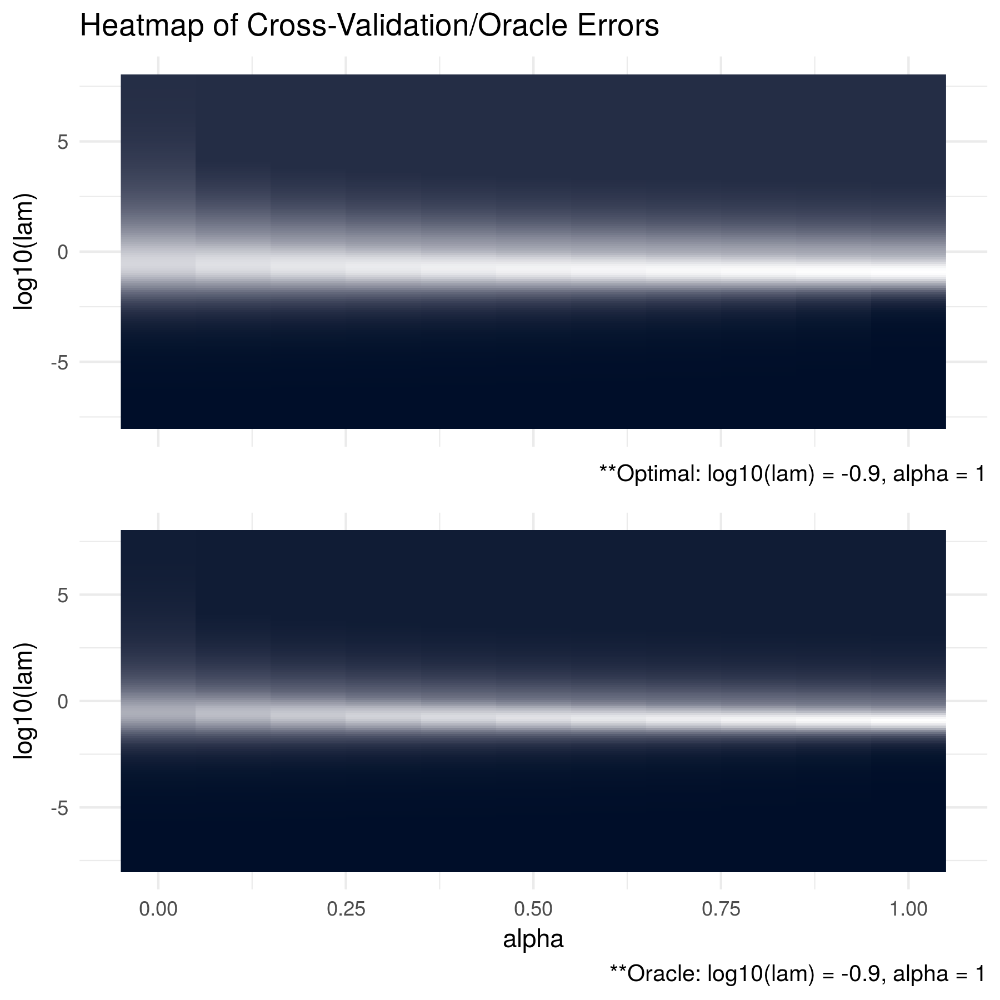

--- 
title: "Shrinking Characteristics of Precision Matrix Estimators: An Illustration via Regression"
author: "Matt Galloway"
date: "`r Sys.Date()`"
site: bookdown::bookdown_site
output:
  bookdown::pdf_book:
    toc_depth: 2
    fig_caption: yes
    includes:
      in_header: preamble.tex
  bookdown::gitbook:
    toc_depth: 2
documentclass: report
bibliography: [lib.bib, packages.bib]
#bibliography: lib.bib
biblio-style: apalike
#geometry: "left=4cm, right=3cm, top=2.5cm, bottom=2.5cm"
#geometry: "left = 1.5in, right = 1in, top = 1in, bottom = 1in"
geometry: "left = 1in, right = 1in, top = 1in, bottom = 1in"
colorlinks: yes
lot: no
lof: no
toc_appendix: yes
fontsize: 11pt
linestretch: 1.5
link-citations: yes
url: 'http://mattxgalloway.com/oral_manuscript/'
github-repo: MGallow/oral_manuscript
description: "Matt Galloway's Master's thesis."
---

```{r setup, include=FALSE}
knitr::opts_chunk$set(echo = TRUE, cache = TRUE, tidy = TRUE, out.width = "90%", fig.align = "center", out.extra = "")

```

```{r include=FALSE}
# automatically create a bib database for R packages
knitr::write_bib(c(.packages(), "glasso", "ADMMsigma", "SCPME"), 'packages.bib')

```


<!--chapter:end:index.Rmd-->


# Introduction {#intro}


In many statistical applications, estimating the covariance matrix, $\Sigma$, for a set of random variables is a critical task. The covariance matrix is useful because it characterizes the *relationship* between variables. For instance, suppose we have three variables $X, Y, \mbox{ and } Z$ and their covariance matrix is of the form

\begin{equation}
\Sigma_{xyz} = \begin{pmatrix}
1 & 0 & 0.5 \\ 
0 & 1 & 0 \\ 
0.5 & 0 & 1
\end{pmatrix}
(\#eq:ex)\notag
\end{equation}

We can gather valuable information from this matrix. First of all, we know that each of the variables has an equal variance of 1. Second,  we know that variables $X$ and $Y$ are likely independent because the covariance between the two is equal to 0. This implies that any information in $X$ is useless in trying to gather information about $Y$. Lastly, we know that variables $X$ and $Z$ are moderately, positively correlated because their covariance is 0.5.

Unfortunately, estimating $\Sigma$ well is often computationally expensive and, in a few settings, extremely challenging. For this reason, emphasis in the literature and elsewhere has been placed on estimating the inverse of $\Sigma$ which we like to denote as $\Omega \equiv \Sigma^{-1}$.

### references

The reference we need here is @molstad2017shrinking!

1. From @molstad2017shrinking: "To fit many predictive models, only a characteristic of the population precision matrix needs to be estimated. For example, in binary linear discriminant analysis, the population precision matrix is needed for prediction only through the product of the precision matrix and the difference between the two conditional distribution mean vectors. Many authors have proposed methods that directly estimate this characteristic @cai2011direct; @fan2012road; @mai2012direct."

2. From @molstad2017shrinking: "@chen2016regularized proposed a method for estimating the characteristic $\Omega_{*}\mu_{*}$ directly, but like the direct linear discriminant methods, this apporach does not lead to an estimate of $\Omega_{*}$."

3. Discuss linear regression application.... where $\beta = \Omega_{*}\Sigma_{*XY}$. Like @witten2009covariance, this approach estimates the regression coefficients "using shrinkage estimators of the marginal precision matrix for the predictors".

- Guide

- Model and notation


## Outline


- Why do we care about covariance matrices? Covariance matrices are an object that summarizes the relationship between variables.

- What is a precision matrix? Precision matrix is the inverse of a covariance matrix.

- Precision matrices are powerful, essential in representing relationships in variables

- In fact, required to be estimated to fit many statistical models.

- That is, we must provide an object that accurately summarizes the relationship and interaction between variables in our model.

- Many proposed shrinkage estimators when p is particularly large. Shrinkage.

- However, to fit these models, Molstad and Rothman focused on the fact that onnly a "characteristic" of a precision matrix is required to fit these models. "We propose a framework to shrink a user-specified characteristic of a precision matrix estimator."

- For instance, LDA, linear regression, ...

- Their approach/methodology was published in BLAH. Shrinking characteristic of precision matrix estimators.

- BREAK

- We wanted to explore the regression application that was mentioned but not pursued/investigated

- This document will outline the research and work leading up to that

- The document is outlined as follows...

- We will begin chapter 2 with a brief introduction to precision matrix estimation. This will include mentions of estimation methods/approaches and we will spend a particular amount of time elaborating on one approach which is estimation via the ADMM algorithm. This dicussion will be useful when we circle back to SCPME, the regression application, and the augmented ADMM algorithm developed in BLAH.

- Lastly, the document will end with two brief tutorials for the R packages ADMMsigma and SCPME. These packages, developed by myself, will be mentioned throughout the document and were instrumental in this pursued line of research and facilitated many simulations and research direction explored throughout. Both packages have since been published on CRAN


### Notation and Definitions

For strictly positive integers $n$ and $p$, we will denote $\mathbb{R}^{n \times p}$ as the class of real matrices with dimenson $n \times p$. The class of real, symmetric matrices with dimension $p \times p$ will be denoted as $\mathbb{S}^{p}$ and $\mathbb{S}^{p}_{+}$ if we further require the object to be positive definite. The sample size in a given data set will most often correspond with $n$ and $p$ will correspond with the dimension of the prediction vector. If the dimension of the response vector exceeds one, we will denote it as $r$.

Most matrices will take the form of either $\Sigma$, which should be taken to represent the population covariance matrix, or $\Omega$, which should be taken to represent the population *precision* matrix. Note that the precision matrix is simply the inverse of the covariance matrix ($\Omega \equiv \Sigma^{-1}$). We will sometimes add a subscript star if the object is oracle - or known- a priori ($\Omega_{*}$) and the population object's estimator that minimizes/maximizes a pre-specified objective function will have a hat attached to it ($\hat{\Omega}$).

There will be significant matrix algebra notation throughout the document. The trace operator which sums the diagonal elements of a matrix will take the form $tr\left(\cdot\right)$ and the *exponential* trace operator will be denoted similarly as $etr\left(\cdot\right)$. The determinant of a matrix $\mathbf{A}$ will be denoted as $\left|\mathbf{A}\right|$ but may also take the form as simply $det\left(\mathbf{A}\right)$. The kronecker product of two matrices $\mathbf{A}$ and $\mathbf{B}$ will be denoted as $\mathbf{A} \otimes \mathbf{B}$. Lastly, the Frobenius norm which sums the square of all entries in a matrix will be denoted as $\left\|\mathbf{A}\right\|_{F}$ and we will define $\left\|\mathbf{A}\right\|_{1} := \sum_{i, j}\left|\mathbf{A}_{ij}\right|$ where the $i$-$j$th element in matrix $\mathbf{A}$ is denoted as $\left(\mathbf{A}\right)_{ij}$ or simply $\mathbf{A}_{ij}$.

<!--chapter:end:01-intro.Rmd-->


# Precision Matrix Estimation


### Literature Review?

- Articles that review covariance and precision matrix estimation in high dimensional settings are @pourahmadi2013high and @fan2016overview.

- The person who initially proposed the lasso-penalized gaussian likelihood precision matrix estimation is @yuan2007model.

- Other authors who have proposed methods with non-lasso penalizations are (Frobenius norms) @witten2009covariance, @rothman2014existence, (non-convex penalties) @lam2009sparsistency, and @fan2009network.

- Standard alternating direction method of multipliers approaches are found in @boyd11distributed.

- ADMM with modification based on majorize-minimize principle is found in @lange2016mm.

- Quadratic equation with ridge is solve in closed form using a similar approach to @witten2009covariance; @price2015ridge.

- L1-penalized gaussian likelihood precision matrix estimator (@yuan2007model; @rothman2008sparse; @friedman2008sparse).

## Background

Consider the case where we observe $n$ independent, identically distributed copies of the random variable ($X_{i}$) where $X_{i} \in \mathbb{R}^{p}$ is normally distributed with some mean, $\mu$, and some variance, $\Omega^{-1}$. That is, $X_{i} \sim N_{p}\left( \mu, \Omega^{-1} \right)$.

Because we assume independence, we know that the probability of observing these specific observations $X_{1}, ..., X_{n}$ is equal to

\begin{equation} 
\begin{split}
  f(X_{1}, ..., X_{n}; \mu, \Omega^{-1}) &= \prod_{i = 1}^{n}(2\pi)^{-p/2}\left| \Omega \right|^{1/2}\exp\left[ -\frac{1}{2}\left( X_{i} - \mu \right)'\Omega\left( X_{i} - \mu \right) \right] \\
  &= (2\pi)^{-np/2}\left| \Omega \right|^{n/2}\mbox{etr}\left[ -\frac{1}{2}\sum_{i = 1}^{n}\left( X_{i} - \mu \right)\left( X_{i} - \mu \right)'\Omega \right]
\end{split}
(\#eq:normallik)\notag
\end{equation} 

where $\mbox{etr}\left( \cdot \right)$ denotes the exponential trace operator. It follows that the log-likelihood for $\mu$ and $\Omega$ is equal to the following:

\begin{equation}
  l(\mu, \Omega | X) = const. + \frac{n}{2}\log\left| \Omega \right| - tr\left[ \frac{1}{2}\sum_{i = 1}^{n}\left(X_{i} - \mu \right)\left(X_{i} - \mu \right)'\Omega \right]
(\#eq:normalloglik)\notag
\end{equation}

If we are interested in estimating $\mu$, it is relatively straight forward to show that the maximum likelihood estimator (MLE) for $\mu$ is $\hat{\mu}^{MLE} = \sum_{i = 1}^{n}X_{i}/n$ which we typically denote as $\bar{X}$. However, in addition to $\mu$, many applications require the estimation of $\Sigma$ as well. We can also find a maximum likelihood estimator:

\begin{equation}
\begin{split}
\hat{\Omega}^{mle} &= \arg\max_{\Omega \in S_{+}^{p}}\left\{ const. + \frac{n}{2}\log\left| \Omega \right| - tr\left[ \frac{1}{2}\sum_{i = 1}^{n}\left(X_{i} - \mu \right)\left(X_{i} - \mu \right)'\Omega \right] \right\} \\
  &= \left[ \frac{1}{n}\sum_{i = 1}^{n}\left(X_{i} - \bar{X} \right)\left(X_{i} - \bar{X} \right)' \right]^{-1}
\end{split}
(\#eq:omegamle)\notag
\end{equation}

By setting the gradient equal to zero and plugging in the MLE for $\mu$, we find that the MLE for $\Omega$ is the inverse our usual sample estimator for the covariance matrix, denoted here as $S^{-1}$. It turns out that we could have just as easily computed the maximum likelihood estimator for the precision matrix $\Omega \equiv \Sigma^{-1}$ and taken its inverse:

\begin{equation}
\hat{\Omega}^{mle} = \arg\min_{\Omega \in S_{+}^{p}}\left\{ tr\left(S\Omega\right) - \log\left|\Omega\right| \right\}
(\#eq:omegamlesimple)
\end{equation}

so that $\hat{\Omega}^{MLE} = S^{-1}$. Beyond the formatting convenience, computing estimates for $\Omega$ as opposed to $\Sigma$ often poses less computational challenges -- and accordingly, the literature has placed more emphasis on efficiently solving for $\Omega$ instead of $\Sigma$^[Notice that here we are *minimizing* the negative log-likelihood as opposed to maximizing the log-likelihood. Both procedures will result in the same estimate.].

As in regression settings, we can construct a *penalized* log-likelihood estimator by adding a penalty term, $P\left(\Omega\right)$, to the log-likelihood so that

\begin{equation}
\hat{\Omega} = \arg\min_{\Omega \in S_{+}^{p}}\left\{ tr\left(S\Omega\right) - \log\left|\Omega \right| + P\left( \Omega \right) \right\}
(\#eq:omegapen)
\end{equation}

$P\left( \Omega \right)$ is often of the form $P\left(\Omega \right) = \lambda\|\Omega \|_{F}^{2}/2$ or $P\left(\Omega \right) = \|\Omega\|_{1}$ where $\lambda > 0$, $\left\|\cdot \right\|_{F}^{2}$ is the Frobenius norm and we define $\left\|A \right\|_{1} = \sum_{i, j} \left| A_{ij} \right|$. These penalties are the ridge and lasso, respectively.


## ADMM algorithm

Many efficient methods have been proposed to solve for $\hat{\Omega}$ when $\alpha = 1$. The most popular method is the graphical lasso algorithm (glasso) introduced by @friedman2008sparse. However, no methods (to the best of my knowledge) have estimated $\Omega$ when $\alpha \in (0, 1)$. We will use the alternating direction method of multipliers (ADMM) algorithm to do so.

As the authors state in @boyd2011distributed, the "ADMM is an algorithm that is intended to blend the decomposability of dual ascent with the superior convergence properties of the method of multipliers." For our purposes, we will only focus on the ADMM algorithm but it is encouraged to read the original text from Boyd and others for a complete introduction to the other two methods.

In general, suppose we want to solve an optimization problem of the following form:

\begin{equation}
\begin{split}
  \mbox{minimize } f(x) + g(z) \\
  \mbox{subject to } Ax + Bz = c
\end{split}
(\#eq:boyd)\notag
\end{equation}

where $x \in \mathbb{R}^{n}, z \in \mathbb{R}^{m}, A \in \mathbb{R}^{p \times n}, B \in \mathbb{R}^{p \times m}$, $c \in \mathbb{R}^{p}$, and $f$ and $g$ are assumed to be convex functions (following @boyd2011distributed, the estimation procedure will be introduced in vector form though we could just as easily take $x$ and $z$ to be matrices). In addition to penalized precision matrix estimation, optimization problems like this arise naturally in several statistics and machine learning applications -- particularly regularization methods. For instance, we could take $f$ to be the squared error loss, $g$ to be the $l_{2}$-norm, $c$ to be equal to zero and $A$ and $B$ to be identity matrices to solve the ridge regression optimization problem. In all cases, our goal is to find $x^{*} \in \mathbb{R}^{n}$ and $z^{*} \in \mathbb{R}^{m}$ that achieves the infimum $p^{*}$:

\begin{equation}
p^{*} = inf\left\{ f(x) + g(z) | Ax + Bz = c \right\}
(\#eq:infimum)\notag
\end{equation}

To do so, the ADMM algorithm uses the *augmented lagrangian*

\begin{equation}
L_{\rho}(x, z, y) = f(x) + g(z) + y'(Ax + Bz - c) + \frac{\rho}{2}\left\| Ax + Bz - c \right\|_{2}^{2}
(\#eq:auglagrange)\notag
\end{equation}

where $y \in \mathbb{R}^{p}$ is the lagrange multiplier and $\rho > 0$ is a scalar. Clearly any minimizer, $p^{*}$, under the augmented lagrangian is equivalent to that of the lagrangian since any feasible point $(x, z)$ satisfies the constraint $\rho\left\| Ax + Bz - c \right\|_{2}^{2}/2 = 0$.

The algorithm consists of the following repeated iterations:

\begin{equation}
\begin{split}
  x^{k + 1} &= \arg\min_{x \in \mathbb{R}^{n}}L_{\rho}(x, z^{k}, y^{k}) \\
  z^{k + 1} &= \arg\min_{z \in \mathbb{R}^{m}}L_{\rho}(x^{k + 1}, z, y^{k}) \\
  y^{k + 1} &= y^{k} + \rho(Ax^{k + 1} + Bz^{k + 1} - c)
\end{split}  
(\#eq:admmalgo)\notag
\end{equation}

In the context of precision matrix estimation, we can let $f$ be equal to the non-penalized likelihood, $g$ be equal to $P\left( \Omega \right)$, and use the constraint $\Omega$ equal to some $Z$ so that the lagrangian is

\begin{equation}
L_{\rho}(\Omega, Z, \Lambda) = f\left(\Omega\right) + g\left(Z\right) + tr\left[\Lambda\left(\Omega - Z\right)\right]
(\#eq:lagrange2)\notag
\end{equation}

and the augmented lagrangian is

\begin{equation}
L_{\rho}(\Omega, Z, \Lambda) = f\left(\Omega\right) + g\left(Z\right) + tr\left[\Lambda\left(\Omega - Z\right)\right] + \frac{\rho}{2}\left\|\Omega - Z\right\|_{F}^{2}
(\#eq:auglagrange2)\notag
\end{equation}


\vspace{3cm}

In the `ADMMsigma` package, we instead take

\begin{equation}
P\left( \Omega \right) = \lambda\left[\frac{1 - \alpha}{2}\left\| \Omega \right|_{F}^{2} + \alpha\left\| \Omega \right\|_{1} \right]
(\#eq:penelastic)\notag
\end{equation}

so that solving the full penalized log-likelihood for $\Omega$ results in solving

\begin{equation}
\hat{\Omega} = \arg\min_{\Omega \in S_{+}^{p}}\left\{ tr\left(S\Omega\right) - \log\left|\Omega \right| + \lambda\left[\frac{1 - \alpha}{2}\left\| \Omega \right|_{F}^{2} + \alpha\left\| \Omega \right\|_{1} \right] \right\}
(\#eq:optimelastic)
\end{equation}

where $0 \leq \alpha \leq 1$. This penalty, know as the *elastic-net* penalty, was explored by Hui Zou and Trevor Hastie [@zou2005regularization] and is identical to the penalty used in the popular penalized regression package `glmnet`. Clearly, when $\alpha = 0$ the elastic-net reduces to a ridge-type penalty and when $\alpha = 1$ it reduces to a lasso-type penalty. Having this flexibility and generalization allows us to perform cross validation across proposed $\alpha$ values in addition to proposed $\lambda$ values.


The ADMM algorithm is now the following:

\begin{align}
  \Omega^{k + 1} &= \arg\min_{\Omega \in \mathbb{S}_{+}^{p}}\left\{ tr\left(S\Omega\right) - \log\left|\Omega\right| + tr\left[\Lambda^{k}\left(\Omega - Z^{k}\right)\right] + \frac{\rho}{2}\left\| \Omega - Z^{k} \right\|_{F}^{2} \right\} (\#eq:omegaauglagrangee) \\
  Z^{k + 1} &= \arg\min_{Z \in \mathbb{S}^{p}}\left\{ \lambda\left[ \frac{1 - \alpha}{2}\left\| Z \right\|_{F}^{2} + \alpha\left\| Z \right\|_{1} \right] + tr\left[\Lambda^{k}\left(\Omega^{k + 1} - Z\right)\right] + \frac{\rho}{2}\left\| \Omega^{k + 1} - Z \right\|_{F}^{2} \right\} (\#eq:ZZauglagrange) \\
  \Lambda^{k + 1} &= \Lambda^{k} + \rho\left( \Omega^{k + 1} - Z^{k + 1} \right) (\#eq:lamauglagrange)
\end{align}


### Algorithm

Set $k = 0$ and initialize $Z^{0}, \Lambda^{0}$, and $\rho$. Repeat steps 1-3 until convergence:

1. Decompose $S + \Lambda^{k} - \rho Z^{k} = VQV'$ via spectral decomposition^[Proof of \@ref(eq:omegaalgo) in section \@ref(proofomegaalgo).]. Then

\begin{equation}
\Omega^{k + 1} = \frac{1}{2\rho}V\left[ -Q + \left( Q^{2} + 4\rho I_{p} \right)^{1/2} \right]V'
(\#eq:omegaalgo)
\end{equation}

2. Elementwise soft-thresholding for all $i = 1,..., p$ and $j = 1,..., p$^[Proof of \@ref(eq:ZZalgo) in section \@ref(proofZZalgo).].

\begin{equation}
\begin{split}
Z_{ij}^{k + 1} &= \frac{1}{\lambda(1 - \alpha) + \rho}\mbox{sign}\left(\rho\Omega_{ij}^{k + 1} + \Lambda_{ij}^{k}\right)\left( \left| \rho\Omega_{ij}^{k + 1} + \Lambda_{ij}^{k} \right| - \lambda\alpha \right)_{+} \\
&= \frac{1}{\lambda(1 - \alpha) + \rho}\mbox{soft}\left(\rho\Omega_{ij}^{k + 1} + \Lambda_{ij}^{k}, \lambda\alpha\right)
(\#eq:ZZalgo)
\end{split}
\end{equation}

3. Update $\Lambda^{k + 1}$.

\begin{equation}
\Lambda^{k + 1} = \Lambda^{k} + \rho\left( \Omega^{k + 1} - Z^{k + 1} \right)
(\#eq:lamalgo)\notag
\end{equation}

where $\mbox{soft}(a, b) = \mbox{sign}(a)(\left| a \right| - b)_{+}$.


### Scaled-Form ADMM

There is another popular, alternate form of the ADMM algorithm used by scaling the dual variable ($\Lambda^{k}$). Let us define $R^{k} = \Omega - Z^{k}$ and $U^{k} = \Lambda^{k}/\rho$.

\begin{equation}
\begin{split}
  tr\left[ \Lambda^{k}\left( \Omega - Z^{k} \right) \right] + \frac{\rho}{2}\left\| \Omega - Z^{k} \right\|_{F}^{2} &= tr\left[ \Lambda^{k}R^{k} \right] + \frac{\rho}{2}\left\| R^{k} \right\|_{F}^{2} \\
  &= \frac{\rho}{2}\left\| R^{k} + \Lambda^{k}/\rho \right\|_{F}^{2} - \frac{\rho}{2}\left\| \Lambda^{k}/\rho \right\|_{F}^{2} \\
  &= \frac{\rho}{2}\left\| R^{k} + U^{k} \right\|_{F}^{2} - \frac{\rho}{2}\left\| U^{k} \right\|_{F}^{2}
(\#eq:scaled)\notag
\end{split}
\end{equation}

Therefore, a scaled-form can now be written as

\begin{align}
  \Omega^{k + 1} &= \arg\min_{\Omega \in \mathbb{R}_{+}^{p}}\left\{ tr\left(S\Omega\right) - \log\left|\Omega\right| + \frac{\rho}{2}\left\| \Omega - Z^{k} + U^{k} \right\|_{F}^{2} \right\} (\#eq:omegascaled)\notag \\
  Z^{k + 1} &= \arg\min_{Z \in \mathbb{S}^{p}}\left\{ \lambda\left[ \frac{1 - \alpha}{2}\left\| Z \right\|_{F}^{2} + \alpha\left\| Z \right\|_{1} \right] + \frac{\rho}{2}\left\| \Omega^{k + 1} - Z + U^{k} \right\|_{F}^{2} \right\} (\#eq:ZZscaled)\notag \\
  U^{k + 1} &= U^{k} + \Omega^{k + 1} - Z^{k + 1} (\#eq:Uscaled)\notag
\end{align}

And more generally (in vector form),

\begin{align}
  x^{k + 1} &= \arg\min_{x}\left\{ f(x) + \frac{\rho}{2}\left\| Ax + Bz^{k} - c + u^{k} \right\|_{2}^{2} \right\} (\#eq:xscaled)\notag \\
  z^{k + 1} &= \arg\min_{z}\left\{ g(z) + \frac{\rho}{2}\left\| Ax^{k + 1} + Bz - c + u^{k} \right\|_{2}^{2} \right\} (\#eq:zscaled)\notag \\
  u^{k + 1} &= u^{k} + Ax^{k + 1} + Bz^{k + 1} - c (\#eq:uscaled)\notag
\end{align}

Note that there are limitations to using this method. Because the dual variable is scaled by $\rho$ (the step size), this form limits one to using a constant step size without making further adjustments to $U^{k}$. It has been shown in the literature that a dynamic step size (like the one used in `ADMMsigma`) can significantly reduce the number of iterations required for convergence.


### Stopping Criterion

In discussing the optimality conditions and stopping criterion, we will follow the steps outlined in @boyd2011distributed and cater them to precision matrix estimation.

Below we have three optimality conditions:

1. Primal:

\begin{equation}
\Omega^{k + 1} - Z^{k + 1} = 0
(\#eq:admmprimal)\notag
\end{equation}

2. Dual:

\begin{equation}
\begin{split}
  0 &\in \partial f\left(\Omega^{k + 1}\right) + \Lambda^{k + 1} \\
  0 &\in \partial g\left(Z^{k + 1}\right) - \Lambda^{k + 1}
(\#eq:admmdual)\notag
\end{split}
\end{equation}

The first dual optimality condition is a result of taking the sub-differential of the lagrangian (non-augmented) with respect to $\Omega^{k + 1}$ (note that we must honor the symmetric constraint of $\Omega^{k + 1}$) and the second is a result of taking the sub-differential of the lagrangian with respect to $Z^{k + 1}$ (no symmetric constraint).

We will define the left-hand side of the first condition as the primal residual $r^{k + 1} = \Omega^{k + 1} - Z^{k + 1}$. At convergence, optimality conditions require that $r^{k + 1} \approx 0$. The second residual we will define is the dual residual $s^{k + 1} = \rho\left( Z^{k + 1} - Z^{k} \right)$. This residual is derived from the following:

Because $\Omega^{k + 1}$ is the minimizer of the augmented lagragian^[Proof of \@ref(eq:dualresidual) in section \@ref(proofdualresidual).], this implies that $0 \in \partial L_{p}\left( \Omega, Z^{k}, \Lambda^{k} \right)$ which further implies that

\begin{equation}
0 \in \rho\left( Z^{k + 1} - Z^{k} \right)
(\#eq:dualresidual)
\end{equation}

Like the primal residual, at convergence optimality conditions require that $s^{k + 1} \approx 0$. Note that the second dual optimality condition is always satisfied^[Proof of \@ref(eq:dualopt) in section \@ref(proofdualopt).]:

\begin{equation}
\begin{split}
  0 \in \partial g\left(Z^{k + 1}\right) - \Lambda^{k + 1} \\
(\#eq:dualopt)
\end{split}
\end{equation}

One possible stopping criterion is to set $\epsilon^{rel} = \epsilon^{abs} = 10^{-3}$ and stop the algorithm when $\epsilon^{pri} \leq \left\| r^{k + 1} \right\|_{F}$ and $\epsilon^{dual} \leq \left\| s^{k + 1} \right\|_{F}$ where

\begin{equation}
\begin{split}
  \epsilon^{pri} &= p\epsilon^{abs} + \epsilon^{rel}\max\left\{ \left\| \Omega^{k + 1} \right\|_{F}, \left\| Z^{k + 1} \right\|_{F} \right\} \\
  \epsilon^{dual} &= p\epsilon^{abs} + \epsilon^{rel}\left\| \Lambda^{k + 1} \right\|_{F}
(\#eq:admmstopping)\notag
\end{split}
\end{equation}


## Simulations

In the simulations below, we generate data from a number of different oracle precision matrices with various structures. For each data-generating procedure, the `ADMMsigma()` function was run using 5-fold cross validation. After 20 replications, the cross validation errors were totalled and the optimal tuning parameters were selected (results below the top figure). These results are compared with the Kullback Leibler (KL) losses between the estimates and the oracle precision matrix (bottom figure).

We can see below that our cross validation procedure consistently chooses tuning parameters that are close to the optimal parameters with respsect to the oracle.

HOW DID WE GENERATE THE DATA?


### Plots

#### Compound Symmetric: P = 100, N = 50

```{r, message = FALSE, echo = TRUE, eval = FALSE}

# oracle precision matrix
Omega = matrix(0.9, ncol = 100, nrow = 100)
diag(Omega = 1)

# generate covariance matrix
S = qr.solve(Omega)

# generate data
Z = matrix(rnorm(100*50), nrow = 50, ncol = 100)
out = eigen(S, symmetric = TRUE)
S.sqrt = out$vectors %*% diag(out$values^0.5) %*% t(out$vectors)
X = Z %*% S.sqrt

```
<br>\vspace{0.5cm}

<!-- <center> -->
<!-- { -->
<!-- width=90% } -->
<!-- </center> -->

```{r admmsim1, eval = T, echo = F, fig.cap = "Figure caption here."}

knitr::include_graphics("images/compound_N50_P100.png")

```

#### Compound Symmetric: P = 10, N = 1000

```{r, message = FALSE, echo = TRUE, eval = FALSE}

# oracle precision matrix
Omega = matrix(0.9, ncol = 10, nrow = 10)
diag(Omega = 1)

# generate covariance matrix
S = qr.solve(Omega)

# generate data
Z = matrix(rnorm(10*1000), nrow = 1000, ncol = 10)
out = eigen(S, symmetric = TRUE)
S.sqrt = out$vectors %*% diag(out$values^0.5) %*% t(out$vectors)
X = Z %*% S.sqrt

```
<br>\vspace{0.5cm}

<!-- <center> -->
<!-- { -->
<!-- width=90% } -->
<!-- </center> -->

```{r admmsim2, eval = T, echo = F, fig.cap = "Figure caption here."}

knitr::include_graphics("images/compound_N1000_P10.png")

```


<!-- #### Dense: P = 100, N = 50 -->

<!-- ```{r, message = FALSE, echo = TRUE, eval = FALSE, tidy = FALSE} -->

<!-- # generate eigen values -->
<!-- eigen = c(rep(1000, 5, rep(1, 100 - 5))) -->

<!-- # randomly generate orthogonal basis (via QR) -->
<!-- Q = matrix(rnorm(100*100), nrow = 100, ncol = 100) %>% qr %>% qr.Q -->

<!-- # generate covariance matrix -->
<!-- S = Q %*% diag(eigen) %*% t(Q) -->

<!-- # generate data -->
<!-- Z = matrix(rnorm(100*50), nrow = 50, ncol = 100) -->
<!-- out = eigen(S, symmetric = TRUE) -->
<!-- S.sqrt = out$vectors %*% diag(out$values^0.5) %*% t(out$vectors) -->
<!-- X = Z %*% S.sqrt -->

<!-- ``` -->
<!-- <br>\vspace{0.5cm} -->

<!-- <!-- <center> --> -->
<!-- <!-- { --> -->
<!-- <!-- width=90% } --> -->
<!-- <!-- </center> --> -->
<!-- <!-- } --> -->

<!-- ```{r admmsim3, eval = T, echo = F, fig.cap = "Figure caption here."} -->

<!-- knitr::include_graphics("images/repsKLdenseQR_N50_P100.png") -->

<!-- ``` -->


<!-- #### Dense: P = 10, N = 50 -->

<!-- ```{r, message = FALSE, echo = TRUE, eval = FALSE, tidy = FALSE} -->

<!-- # generate eigen values -->
<!-- eigen = c(rep(1000, 5, rep(1, 10 - 5))) -->

<!-- # randomly generate orthogonal basis (via QR) -->
<!-- Q = matrix(rnorm(10*10), nrow = 10, ncol = 10) %>% qr %>% qr.Q -->

<!-- # generate covariance matrix -->
<!-- S = Q %*% diag(eigen) %*% t(Q) -->

<!-- # generate data -->
<!-- Z = matrix(rnorm(10*50), nrow = 50, ncol = 10) -->
<!-- out = eigen(S, symmetric = TRUE) -->
<!-- S.sqrt = out$vectors %*% diag(out$values^0.5) %*% t(out$vectors) -->
<!-- X = Z %*% S.sqrt -->

<!-- ``` -->
<!-- <br>\vspace{0.5cm} -->

<!-- <!-- <center> --> -->
<!-- <!-- { --> -->
<!-- <!-- width=90% } --> -->
<!-- <!-- </center> --> -->

<!-- ```{r admmsim4, eval = T, echo = F, fig.cap = "Figure caption here."} -->

<!-- knitr::include_graphics("images/repsKLdense_N50_P10.png") -->

<!-- ``` -->


#### Tridiagonal: P = 100, N = 50

```{r, message = FALSE, echo = TRUE, eval = FALSE, tidy = FALSE}

# generate covariance matrix
# (can confirm inverse is tri-diagonal)
S = matrix(0, nrow = 100, ncol = 100)
for (i in 1:100){
  for (j in 1:100){
    S[i, j] = 0.7^abs(i - j)
  }
}

# generate data
Z = matrix(rnorm(10*50), nrow = 50, ncol = 10)
out = eigen(S, symmetric = TRUE)
S.sqrt = out$vectors %*% diag(out$values^0.5) %*% t(out$vectors)
X = Z %*% S.sqrt

```
<br>\vspace{0.5cm}

<!-- <center> -->
<!-- { -->
<!-- width=90% } -->
<!-- </center> -->

```{r admmsim5, eval = T, echo = F, fig.cap = "Figure caption here."}


```

<!--chapter:end:02-PME.Rmd-->


# SCPME


### literature review?

- A similar estimator was proposed by @dalal2017sparse when $C = 0$.

- - Quadratic equation with ridge is solve in closed form using a similar approach to @witten2009covariance; @price2015ridge.


###  other stuff

The penalty proposed by @molstad2017shrinking is one of the following form:

\begin{equation}
P\left(\Omega\right) = \lambda\left\| A\Omega B - C \right\|_{1}
(\#eq:pen2)
\end{equation}

where $A \in \mathbb{R}^{m \times p}, B \in \mathbb{R}^{p \times q}, \mbox{ and } C \in \mathbb{R}^{m \times q}$ are matrices assumed to be known and specified by the user. Solving the full penalized log-likelihood for $\Omega$ results in solving

\begin{equation}
\hat{\Omega} = \arg\min_{\Omega \in S_{+}^{p}}\left\{ tr\left(S\Omega\right) - \log\left|\Omega \right| + \lambda\left\| A\Omega B - C \right\|_{1} \right\}
(\#eq:omegaloglik2)
\end{equation}

This form of penalty is particularly useful because matrices $A, B, \mbox{ and } C$ can be constructed so that we penalize the sum, absolute value of a *characteristic* of the precision matrix $\Omega$. This type of penalty leads to many new, interesting, and novel estimators for $\Omega$. An example of one such estimator (suppose we observe $n$ samples of $Y_{i} \in \mathbb{R}^{r}$) would be one where we set $A = I_{p}, B = \Sigma_{xy}, \mbox{ and } C = 0$ where $\Sigma_{xy}$ is the covariance matrix of $X$ and $Y$. This penalty has the effect of assuming sparsity in the forward regression coefficient $\beta \equiv \Omega\Sigma_{xy}$. Of course, in practice we do not know the true covariance matrix $\Sigma_{xy}$ but we might consider using the sample estimate $\hat{\Sigma}_{xy} = \sum_{i = 1}^{n}\left(X_{i} - \bar{X}\right)\left(Y_{i} - \bar{Y}\right)^{T}/n$

We will explore how to solve for $\hat{\Omega}$ in the next section.


## Augmented ADMM Algorithm

*This section requires general knowledge of the alternating direction method of multipliers (ADMM) algorithm. I would recommend reading this overview I have written [here](https://mgallow.github.io/ADMMsigma/articles/Details.html#admm-algorithm) before proceeding.*

The ADMM algorithm - thanks to it's flexibility - is particularly well-suited to solve penalized-likelihood optimization problems that arise naturally in several statistics and machine learning applications. Within the context of @molstad2017shrinking, this algorithm would consist of iterating over the following three steps:

\begin{align}
  \Omega^{k + 1} &= \arg\min_{\Omega \in \mathbb{S}_{+}^{p}}L_{\rho}(\Omega, Z^{k}, \Lambda^{k}) (\#eq:omegaauglagrange2)\notag \\
  Z^{k + 1} &= \arg\min_{Z \in \mathbb{R}^{n \times r}}L_{\rho}(\Omega^{k + 1}, Z, \Lambda^{k}) (\#eq:ZZauglagrange2)\notag \\
  \Lambda^{k + 1} &= \Lambda^{k} + \rho\left(A\Omega^{k + 1}B - Z^{k + 1} - C \right) (\#eq:lamauglagrange2)\notag
\end{align}

where $L_{p}(\cdot)$ is the *augmented lagrangian* defined as

\begin{equation}
L_{\rho}(\Omega, Z, \Lambda) = f\left(\Omega\right) + g\left(Z\right) + tr\left[\Lambda^{T}\left(A\Omega B - Z - C\right)\right] + \frac{\rho}{2}\left\|A\Omega B - Z - C\right\|_{F}^{2}
(\#eq:auglagrange2)
\end{equation}

with $f\left(\Omega\right) = tr\left(S\Omega\right) - \log\left|\Omega\right|$ and $g\left(Z\right) = \lambda\left\|Z\right\|_{1}$. However, instead of solving the first step exactly, the authors propose an alternative, approximating objective function ($\tilde{L}$) based on the majorize-minimize principle -- the purpose of which is to find a solution that can be solved in closed form.

The approximating function is defined as

\begin{equation}
\begin{split}
  \tilde{L}_{\rho}\left(\Omega, Z^{k}, \Lambda^{k}\right) = f\left(\Omega\right) &+ tr\left[(\Lambda^{k})^{T}(A\Omega B - Z^{k} - C) \right] + \frac{\rho}{2}\left\|A\Omega B - Z^{k} - C \right\|_{F}^{2} \\
  &+ \frac{\rho}{2}vec\left(\Omega - \Omega^{k}\right)^{T}Q\left(\Omega - \Omega^{k}\right)\notag
(\#eq:approx)
\end{split}
\end{equation}

where $Q = \tau I_{p} - \left(A^{T}A \otimes BB^{T}\right)$, $\otimes$ is the Kronecker product, and $\tau$ is chosen such that $Q$ is positive definite. Note that if $Q$ is positive definite (p.d.), then

\begin{equation}
\frac{\rho}{2}vec\left(\Omega - \Omega^{k} \right)^{T}Q\left(\Omega - \Omega^{k} \right) > 0
(\#eq:pd)\notag
\end{equation}

since $\rho > 0$ and $vec\left(\Omega - \Omega^{k}\right)$ is always nonzero whenever $\Omega \neq \Omega^{k}$. Thus $L_{\rho}\left(\cdot\right) \leq \tilde{L}\left(\cdot\right)$ for all $\Omega$ and $\tilde{L}$ is a majorizing function^[Proof of BLAH in section BLAHHH].

The *augmented ADMM* algorithm is the following:

\begin{align}
  \Omega^{k + 1} &= \arg\min_{\Omega \in \mathbb{S}_{+}^{p}}\left\{tr\left[\left(S + G^{k}\right)\Omega\right] - \log\left|\Omega\right| + \frac{\rho\tau}{2}\left\|\Omega - \Omega^{k}\right\|_{F}^{2} \right\} (\#eq:omegaaugadmm)\notag \\
  Z^{k + 1} &= \arg\min_{Z \in \mathbb{R}^{n \times r}}\left\{\lambda\left\|Z\right\|_{1} + tr\left[(\Lambda^{k})^{T}(A\Omega B - Z^{k} - C) \right] + \frac{\rho}{2}\left\|A\Omega B - Z^{k} - C \right\|_{F}^{2} \right\} (\#eq:ZZaugadmm)\notag \\
  \Lambda^{k + 1} &= \Lambda^{k} + \rho\left(A\Omega^{k + 1}B - Z^{k + 1} - C \right) (\#eq:lamaugadmm)\notag
\end{align}


### Algorithm

Set $k = 0$ and repeat steps 1-6 until convergence.

1. Compute $G^{k}$.

\begin{equation}
G^{k} = \rho A^{T}\left( A\Omega^{k} B - Z^{k} - C + \rho^{-1}Y^{k} \right)B^{T}
(\#eq:Gk)\notag
\end{equation}

2. Via spectral decomposition, decompose

\begin{equation}
S + \left( G^{k} + (G^{k})^{T} \right)/2 - \rho\tau\Omega^{k} = VQV^{T}
(\#eq:VQV)\notag
\end{equation}

3. Update $\Omega^{k + 1}$.^[Proof of \@ref(eq:Omegak) in section \@ref(proofOmegak)]

\begin{equation}
\Omega^{k + 1} = V\left( -Q + (Q^{2} + 4\rho\tau I_{p})^{1/2} \right)V^{T}/(2\rho\tau)
(\#eq:Omegak)
\end{equation}

4. Update $Z^{k + 1}$.^[Proof of \@ref(eq:Zk) in section \@ref(proofZk)]

\begin{equation}
Z^{k + 1} = \mbox{soft}\left( A\Omega^{k + 1}B - C + \rho^{-1}Y^{k}, \rho^{-1}\lambda \right)
(\#eq:Zk)
\end{equation}

5. Update $Y^{k + 1}$.

\begin{equation}
Y^{k + 1} = \rho\left( A\Omega^{k + 1} B - Z^{k + 1} - C \right)
(\#eq:Yk)\notag
\end{equation}

6. Replace $k$ with $k + 1$.

The soft-thresholding function is defined as $\mbox{soft}(a, b) = \mbox{sign}(a)(\left| a \right| - b)_{+}$.


### Stopping Criterion

In discussing the optimality conditions and stopping criterion, we will follow the steps outlined in @boyd2011distributed and cater them to the SCPME method.

Below we have three optimality conditions:

1. Primal:

\begin{equation}
A\Omega^{k + 1}B - Z^{k + 1} - C = 0
(\#eq:scpmeprimal)\notag
\end{equation}

2. Dual:

\begin{equation}
\begin{split}
  0 &\in \partial f\left(\Omega^{k + 1}\right) + \frac{1}{2}\left(B(\Lambda^{k + 1})^{T}A + A^{T}\Lambda^{k + 1}B^{T} \right) \\
  0 &\in \partial g\left(Z^{k + 1}\right) - \Lambda^{k + 1}
(\#eq:scpmedual)\notag
\end{split}
\end{equation}

The first dual optimality condition is a result of taking the sub-differential of the lagrangian (non-augmented) with respect to $\Omega^{k + 1}$ (note that we must honor the symmetric constraint of $\Omega^{k + 1}$) and the second is a result of taking the sub-differential of the lagrangian with respect to $Z^{k + 1}$ (no symmetric constraint).

We will define the left-hand side of the primal optimality condition as the primal residual $r^{k + 1} = A\Omega^{k + 1}B - Z^{k + 1} - C$. At convergence, the optimality conditions require that $r^{k + 1} \approx 0$. The second residual we will define is the dual residual^[Proof of \@ref(eq:stopproof) in section \@ref(proofstopproof).]:

\begin{equation}
s^{k + 1} = \frac{\rho}{2}\left( B(Z^{k + 1} - Z^{k})^{T}A + A^{T}(Z^{k + 1} - Z^{k})B^{T} \right)
(\#eq:stopproof)\notag
\end{equation}

Like the primal residual, at convergence the optimality conditions require that $s^{k + 1} \approx 0$. Note that the second dual optimality condition is always satisfied^[Proof of \@ref(eq:dualopt2) in section \@ref(proofdualopt2)].

\begin{equation}
\begin{split}
  0 &\in \partial g\left(Z^{k + 1}\right) - \Lambda^{k + 1}
(\#eq:dualopt2)\notag
\end{split}
\end{equation}

One possible stopping criterion is to set $\epsilon^{rel} = \epsilon^{abs} = 10^{-3}$ and stop the algorithm when $\epsilon^{pri} \leq \left\| r^{k + 1} \right\|_{F}$ and $\epsilon^{dual} \leq \left\| s^{k + 1} \right\|_{F}$ where

\begin{equation}
\begin{split}
  \epsilon^{pri} &= \sqrt{nr}\epsilon^{abs} + \epsilon^{rel}\max\left\{ \left\| A\Omega^{k + 1}B \right\|_{F}, \left\| Z^{k + 1} \right\|_{F}, \left\| C \right\|_{F} \right\} \\
  \epsilon^{dual} &= p\epsilon^{abs} + \epsilon^{rel}\left\| \left( B(\Lambda^{k + 1})^{T}A + A^{T}\Lambda^{k + 1}B^{T} \right)/2 \right\|_{F}
(\#eq:scpmestopping)\notag
\end{split}
\end{equation}


<!--chapter:end:03-SCPME.Rmd-->


# Regression Illustration

Talk about regression problem...


## Simulations

We compare the performance of various shrinkage estimators under different data realizations. Each data scenario was replicated a total of 20 times.


### Models

In the following estimators, let the superscript * denote the oracle estimator:
 
 - `OLS` = ordinary least squares estimator in *low* dimensional setting and Moore-Penrose estimator in a *high* ($p >> n$) dimensional setting
 
 - `ridge` = ridge regression estimator where the optimal tuning parameter is chosen to minimize in-sample MSPE via 3-fold CV
 
 - `lasso` = lasso regression estimator where the optimal tuning parameter is chosen to minimize in-sample MSPE via 3-fold CV
 
 - `oracleB` = oracle estimator with the true $\beta^{*}$ known ($\left\| Y - X\beta^{*} \right\|_{F}^{2}$)
 
 - `oracleO` = oracle estimator with the true $\Omega^{*}$ known ($\left\| Y - X\Omega^{*}\hat{\Sigma}_{xy} \right\|_{F}^{2}$)
 
 - `oracleS` = oracle estimator with the true $\Sigma_{xy}^{*}$ known and sample estimator for $\Omega$ ($\left\| Y - X\hat{\Omega}\Sigma_{xy}^{*} \right\|_{F}^{2}$)
 
 - `shrinkB` = shrinking characteristics regression estimator where optimal tuning parameter is chosen to minimize in-sample MSPE via 3-fold CV (penalty: $\lambda\left\| \Omega\hat{\Sigma}_{xy} \right\|_{1}$)
 
 - `shrinkBS` = shrinking characteristics regression estimator with oracle cross-covariance where optimal tuning parameter is chosen to minimize in-sample MSPE via 3-fold CV (penalty: $\lambda\left\| \Omega\hat{\Sigma}_{xy}^{*} \right\|_{1}$)
 
 - `shrinkBO` = shrinking characteristics estimator that penalizes the sum of the absolute values of $\beta = \Omega\Sigma_{xy}$ *and* $\Omega$ (penalty: $\lambda\left\| \Omega[\Sigma_{xy}, I_{p}] \right\|_{1}$)
 
 - `glasso` = lasso penalized precision matrix where optimal tuning parameter is chosen to maximize log-likelihood via 3-fold CV.


### Data Generation

Let $\mathbb{X} \in \mathbb{R}^{n \times p}$, $\mathbb{Y} \in \mathbb{R}^{n \times r}$, and $\beta \in \mathbb{R}^{p \times r}$ so that

\begin{equation}
\mathbb{Y} = \mathbb{X}\beta + \mathbb{E}
(\#eq:datalinregression)\notag
\end{equation}

These values are generated in the following way:

Let $\beta = \mathbb{B} \circ \mathbb{V}$ where $vec\left( \mathbb{B} \right) \sim N_{pr}\left( 0, I_{p} \otimes I_{r}/\sqrt{p} \right)$ and $\mathbb{V} \in \mathbb{R}^{p \times r}$ is a matrix containing $pr$ random bernoulli draws with `sparse` probability being equal to 1. In effect, each $\beta$ entry is turned off with equal probability.

Now, if `sigma = "tridiag"` then $\Sigma_{xx}$ and $\Sigma_{y | x}$ is constructed so that $\left( \Sigma_{xx} \right)_{ij} = 0.7^{\left| i - j \right|}$ and $\left( \Sigma_{y | x} \right)_{ij} = 0.7^{\left| i - j \right|}$, respectively. This ensures that the inverses will be tridiagonal (sparse).

Then for $n$ independent, identically distributed samples, we have that $X_{i} \sim N_{p}\left( 0, \Sigma_{xx} \right)$ and $E_{i} \sim N_{r}\left( 0, \Sigma_{y | x} \right)$.

If `sigma = "compound"` then the data is generated similarly but $\Omega_{xx} \equiv \Sigma_{xx}^{-1}$ and $\Omega_{y | x} \equiv \Sigma_{y | x}^{-1}$ both have entries equal to 1 on the diagonal and 0.9 on the off-diagonal.

An additional 1000 samples will be generated for the testing set -- regardless of the training set size ($n$). For instance, in the 3-fold cross validation procedure where `n = 100` and `p = 100`, 1000 samples would be set aside for later testing and $100*(2/3)$ samples would be used for training in each fold (ie: high dimensional setting).

Possible parameters in simulation:

 - `reps` = 20
 - `n` = (100, 1000)
 - `p` = (10, 50, 100, 150)
 - `r` = c(1, 5, 10)
 - `sparse` = c(0.5)
 - `sigma` = c("tridiag")

Note that prior to estimation, the intercept is removed by centering the data.


### Plots

#### High Dimension

Note that we are now displaying model error (ME) as opposed to mean squared prediction error (MSPE). Also, `OLS` and `oracleS` will not be show in the high dimensional setting plots because of poor performance.

```{r scpmesim1, eval = T, echo = F, fig.cap = "Figure caption here."}

# load data
load("images/sim6.Rdata")

# set P to numeric 
sim6$P %<>% as.character %>% as.numeric

# ME by P and R (N = 100, sparse = 0.5, sigma = "tridiag")
sim6 %>% filter(N == 100, sparse == 0.5, sigma == "tridiag", !model %in% c("OLS", "oracleS"), metric == "ME") %>% group_by(N, P, R, sparse, sigma, model) %>% summarise(mean = mean(Error)) %>% ggplot(aes(P, mean, color = model, linetype = model)) + geom_line() + scale_colour_discrete("") + scale_linetype_manual("", values = rep(c(5,6), 5)) + theme_minimal() + theme(legend.position = "bottom") + facet_wrap(~ R, scales = "free") + xlab("P") + labs(color = "Model") + scale_x_continuous(breaks = c(10, 50, 100, 150)) + ylab("ME") + ggtitle("ME by P and R (N = 100, sparse = 0.5, sigma = tridiag)")

```

<br>\vspace{1cm}

```{r scpmesim2, eval = T, echo = F, fig.cap = "Figure caption here."}

# ME by P (N = 100, R = 10, sparse = 0.5, sigma = "tridiag")
sim6 %>% filter(N == 100, R == 10, sparse == 0.5, sigma == "tridiag", !model %in% c("OLS", "oracleS")) %>% group_by(N, P, R, sparse, sigma, model) %>% summarise(mean = mean(Error)) %>% ggplot(aes(P, mean, color = model, linetype = model)) + geom_line() + scale_colour_discrete("") + scale_linetype_manual("", values = rep(c(5,6), 5)) + theme_minimal() + theme(legend.position = "bottom") + xlab("P") + labs(color = "Model") + scale_x_continuous(breaks = c(10, 50, 100, 150)) + ylab("ME") + ggtitle("ME by P (N = 100, R = 10, sparse = 0.5, sigma = tridiag)")

```

<br>\vspace{1cm}

**Notable: N = 100, P = 150, R = 10, sparse = 0.5, sigma = "tridiag"**

```{r scpmesim3, eval = T, echo = F}

# ME table (N = 100, sparse = 0.5, sigma = "tridiag", P = 150, R = 10)
sim6 %>% filter(N == 100, sparse == 0.5, sigma == "tridiag", P == 150, R == 10) %>% group_by(model) %>% summarise(mean = mean(Error), sd = sd(Error)) %>% arrange(mean) %>% pander(caption = "Table caption here.")

```

<br>\vspace{1cm}

#### Low Dimension

```{r scpmesim4, eval = T, echo = F, fig.cap = "Figure caption here."}

# ME by P and R (N = 1000, sparse = 0.5, sigma = "tridiag")
sim6 %>% filter(N == 1000, sparse == 0.5, model != "OLS") %>% group_by(N, P, R, sparse, sigma, model) %>% summarise(mean = mean(Error)) %>% ggplot(aes(P, mean, color = model, linetype = model)) + geom_line() + scale_colour_discrete("") + scale_linetype_manual("", values = rep(c(5,6), 5)) + theme_minimal() + theme(legend.position = "bottom") + facet_wrap(~ R, scales = "free") + xlab("P") + labs(color = "Model") + scale_x_continuous(breaks = c(10, 50, 100, 150)) + ylab("ME") + ggtitle("ME by P and R (N = 1000, sparse = 0.5, sigma = tridiag)")

```

<br>\vspace{1cm}

```{r scpmesim5, eval = T, echo = F, fig.cap = "Figure caption here."}

# ME by P (N = 1000, R = 5, sparse = 0.5, sigma = "tridiag")
sim6 %>% filter(N == 1000, R == 5, sparse == 0.5, model != "OLS") %>% group_by(N, P, R, sparse, sigma, model) %>% summarise(mean = mean(Error)) %>% ggplot(aes(P, mean, color = model, linetype = model)) + geom_line() + scale_colour_discrete("") + scale_linetype_manual("", values = rep(c(5,6), 5)) + theme_minimal() + theme(legend.position = "bottom") + xlab("P") + labs(color = "Model") + scale_x_continuous(breaks = c(10, 50, 100, 150)) + ylab("ME") + ggtitle("ME by P (N = 1000, R = 5, sparse = 0.5, sigma = tridiag)")

```

<br>\vspace{1cm}

**Notable: N = 1000, P = 150, R = 5, sparse = 0.5, sigma = "tridiag"**

```{r scpmesim6, eval = T, echo = F}

# ME table (N = 1000, sparse = 0.5, sigma = "tridiag", P = 150, R = 5)
sim6 %>% filter(N == 1000, sparse == 0.5, sigma == "tridiag", P == 150, R == 5) %>% group_by(model) %>% summarise(mean = mean(Error), sd = sd(Error)) %>% arrange(mean) %>% pander(caption = "Table caption here.")

```


### Takeaways

1. In high dimensional settings, `shrinkBO` (penalty: $\lambda\left\| \Omega[\hat{\Sigma}_{xy}, I_{p}] \right\|_{1}$) and `shrinkB` (penalty: $\lambda\left\| \Omega\hat{\Sigma}_{xy} \right\|_{1}$) perform increasingly well relative (and superior) to the others when $p >> n$. It's not surprising that `shrinkBO` performs the best because the embedded assumptions most closely match the data generating model.

2. In the high dimension setting, the oracle estimators `oracleO` (penalty: $\lambda\left\| \Omega^{*}\hat{\Sigma}_{xy} \right\|_{1}$) and `oracleS` (penalty: $\lambda\left\| \hat{\Omega}\Sigma_{xy}^{*} \right\|_{1}$) performed worse or comparable to OLS. The poor performance of `oracleS` is likely due to the fact that the sample estimate of $\Omega$ is not identifiable when $p > n$.

3. When $n > p$ we see that `shrinkB` performs terribly. Interestingly, `shrinkBO` is still one of the better performing estimators -- though worse than both `lasso` and `ridge`.

4. It is interesting that `oracleO` performed worse than `oracleS` in the final table. It appears that estimating the covariance matrix $\Sigma_{xy}$ well is *more* important than estimating $\Omega$ well.


### Shrinking Covariance Models

In the following estimators, let the superscript * denote the oracle estimator:
 
 - `shrinkB` = shrinking characteristics regression estimator where optimal tuning parameter is chosen to minimize in-sample MSPE via 3-fold CV (penalty: $\lambda\left\| \Omega\hat{\Sigma}_{xy} \right\|_{1}$)
 
 - `shrinkBO` = shrinking characteristics estimator that penalizes the sum of the absolute values of $\beta = \Omega\Sigma_{xy}$ *and* $\Omega$ (penalty: $\lambda\left\| \Omega[\Sigma_{xy}, I_{p}] \right\|_{1}$)
 
For each of the estimators, $\Sigma_{xy}$ is estimated by the sample covariance matrix $\hat{\Sigma}_{xy}$ times some constant factor $k \in (0.1, 0.2, ..., 0.9, 1)$. We are shrinking $\hat{\Sigma}_{xy}$ by a constant to determine if there are any benefits to doing so.


### Data Generation

Let $\mathbb{X} \in \mathbb{R}^{n \times p}$, $\mathbb{Y} \in \mathbb{R}^{n \times r}$, and $\beta \in \mathbb{R}^{p \times r}$ so that

\begin{equation}
\mathbb{Y} = \mathbb{X}\beta + \mathbb{E}
(\#eq:datalinregression2)\notag
\end{equation}

These values are generated in the following way:

Let $\beta = \mathbb{B} \circ \mathbb{V}$ where $vec\left( \mathbb{B} \right) \sim N_{pr}\left( 0, I_{p} \otimes I_{r}/\sqrt{p} \right)$ and $\mathbb{V} \in \mathbb{R}^{p \times r}$ is a matrix containing $pr$ random bernoulli draws with `sparse` probability being equal to 1. In effect, each $\beta$ entry is turned off with equal probability.

Now, if `sigma = "tridiag"` then $\Sigma_{xx}$ and $\Sigma_{y | x}$ is constructed so that $\left( \Sigma_{xx} \right)_{ij} = 0.7^{\left| i - j \right|}$ and $\left( \Sigma_{y | x} \right)_{ij} = 0.7^{\left| i - j \right|}$, respectively. This ensures that the inverses will be tridiagonal (sparse).

Then for $n$ independent, identically distributed samples, we have that $X_{i} \sim N_{p}\left( 0, \Sigma_{xx} \right)$ and $E_{i} \sim N_{r}\left( 0, \Sigma_{y | x} \right)$.

If `sigma = "compound"` then the data is generated similarly but $\Omega_{xx} \equiv \Sigma_{xx}^{-1}$ and $\Omega_{y | x} \equiv \Sigma_{y | x}^{-1}$ both have entries equal to 1 on the diagonal and 0.9 on the off-diagonal.

An additional 1000 samples will be generated for the testing set -- regardless of the training set size ($n$). For instance, in the 3-fold cross validation procedure where `n = 100` and `p = 100`, 1000 samples would be set aside for later testing and $100*(2/3)$ samples would be used for training in each fold (ie: high dimensional setting).

Possible parameters in simulation:

 - `reps` = 20
 - `n` = (100, 1000)
 - `p` = (10, 50, 100, 150, 200)
 - `r` = c(1, 5, 10)
 - `sparse` = c(0.5)
 - `sigma` = c("tridiag", "compound")

Note that prior to estimation, the intercept is removed by centering the data.


### Plots

```{r, eval = T, echo = F}

# load data
load("images/sigma.Rdata")

# design color palette
bluetowhite <- c("#000E29", "white")

# change to numeric
sigma$lam %<>% as.character %>% as.numeric
sigma$const %<>% as.character %>% as.numeric

```

#### High Dimension

##### `shrinkB`

<br>\vspace{1cm}

```{r scpmesim7, eval = T, echo = F, fig.cap = "Figure caption here."}

# shrinkB MSPE by lam and const (N = 100, P = 200, R = 10, sigma = "tridiag")
d = sigma %>% filter(N == 100, P == 200, R == 10, sparse == 0.5, sigma == "tridiag", model == "shrinkB") %>% group_by(lam, const) %>% summarise(mean = mean(Error)) %>% mutate(augmean = 1/(c(mean)))

min = d[d$mean == min(d$mean),]

d %>% ggplot(aes(const, log10(lam))) + geom_raster(aes(fill = augmean)) + scale_fill_gradientn(colours = colorRampPalette(bluetowhite)(2), guide = "none") + theme_minimal() + labs(title = "shrinkB MSPE (N = 100, P = 200, R = 10, sigma = tridiag)", caption = paste("**Optimal: log10(lam) = ", round(log10(min$lam), 3), ", const = ", round(min$const, 3), sep = ""))

```

<br>\vspace{1cm}

```{r scpmesim8, eval = T, echo = F, fig.cap = "Figure caption here."}

# shrinkB MSPE by lam and const (N = 100, P = 200, R = 10, sigma = "compound")
d = sigma %>% filter(N == 100, P == 200, R == 10, sparse == 0.5, sigma == "compound", model == "shrinkB") %>% group_by(lam, const) %>% summarise(mean = mean(Error)) %>% mutate(augmean = 1/(c(mean)))

min = d[d$mean == min(d$mean),]

d %>% ggplot(aes(const, log10(lam))) + geom_raster(aes(fill = augmean)) + scale_fill_gradientn(colours = colorRampPalette(bluetowhite)(2), guide = "none") + theme_minimal() + labs(title = "shrinkB MSPE (N = 100, P = 200, R = 10, sigma = compound)", caption = paste("**Optimal: log10(lam) = ", round(log10(min$lam), 3), ", const = ", round(min$const, 3), sep = ""))

```

##### `shrinkBO`

<br>\vspace{1cm}

```{r scpmesim9, eval = T, echo = F, fig.cap = "Figure caption here."}

# shrinkBO MSPE by lam and const (N = 100, P = 200, R = 10, sigma = "tridiag")
d = sigma %>% filter(N == 100, P == 200, R == 10, sparse == 0.5, sigma == "tridiag", model == "shrinkBO") %>% group_by(lam, const) %>% summarise(mean = mean(Error)) %>% mutate(augmean = 1/(c(mean)))

min = d[d$mean == min(d$mean),]

d %>% ggplot(aes(const, log10(lam))) + geom_raster(aes(fill = augmean)) + scale_fill_gradientn(colours = colorRampPalette(bluetowhite)(2), guide = "none") + theme_minimal() + labs(title = "shrinkBO MSPE (N = 100, P = 200, R = 10, sigma = tridiag)", caption = paste("**Optimal: log10(lam) = ", round(log10(min$lam), 3), ", const = ", round(min$const, 3), sep = ""))

```

<br>\vspace{1cm}

```{r scpmesim10, eval = T, echo = F, fig.cap = "Figure caption here."}

# shrinkBO MSPE by lam and const (N = 100, P = 200, R = 10, sigma = "compound")
d = sigma %>% filter(N == 100, P == 200, R == 10, sparse == 0.5, sigma == "compound", model == "shrinkBO") %>% group_by(lam, const) %>% summarise(mean = mean(Error)) %>% mutate(augmean = 1/(c(mean)))

min = d[d$mean == min(d$mean),]

d %>% ggplot(aes(const, log10(lam))) + geom_raster(aes(fill = augmean)) + scale_fill_gradientn(colours = colorRampPalette(bluetowhite)(2), guide = "none") + theme_minimal() + labs(title = "shrinkBO MSPE (N = 100, P = 200, R = 10, sigma = compound)", caption = paste("**Optimal: log10(lam) = ", round(log10(min$lam), 3), ", const = ", round(min$const, 3), sep = ""))

```

<br>\vspace{1cm}

#### Low Dimension

##### `shrinkB`

<br>\vspace{1cm}

```{r scpmesim11, eval = T, echo = F, fig.cap = "Figure caption here."}

# shrinkB MSPE by lam and const (N = 1000, P = 50, R = 1, sigma = "tridiag")
d = sigma %>% filter(N == 1000, P == 50, R == 1, sparse == 0.5, sigma == "tridiag", model == "shrinkB") %>% group_by(lam, const) %>% summarise(mean = mean(Error)) %>% mutate(augmean = 1/(c(mean)))

min = d[d$mean == min(d$mean),]

d %>% ggplot(aes(const, log10(lam))) + geom_raster(aes(fill = augmean)) + scale_fill_gradientn(colours = colorRampPalette(bluetowhite)(2), guide = "none") + theme_minimal() + labs(title = "shrinkB MSPE (N = 1000, P = 50, R = 1, sigma = tridiag)", caption = paste("**Optimal: log10(lam) = ", round(log10(min$lam), 3), ", const = ", round(min$const, 3), sep = ""))

```

<br>\vspace{1cm}

```{r scpmesim12, eval = T, echo = F, fig.cap = "Figure caption here."}

# shrinkB MSPE by lam and const (N = 1000, P = 50, R = 1, sigma = "compound")
d = sigma %>% filter(N == 1000, P == 50, R == 1, sparse == 0.5, sigma == "compound", model == "shrinkB") %>% group_by(lam, const) %>% summarise(mean = mean(Error)) %>% mutate(augmean = 1/(c(mean)))

min = d[d$mean == min(d$mean),]

d %>% ggplot(aes(const, log10(lam))) + geom_raster(aes(fill = augmean)) + scale_fill_gradientn(colours = colorRampPalette(bluetowhite)(2), guide = "none") + theme_minimal() + labs(title = "shrinkB MSPE (N = 1000, P = 50, R = 1, sigma = compound)", caption = paste("**Optimal: log10(lam) = ", round(log10(min$lam), 3), ", const = ", round(min$const, 3), sep = ""))

```

#### `shrinkBO`

<br>\vspace{1cm}

```{r scpmesim13, eval = T, echo = F, fig.cap = "Figure caption here."}

# shrinkBO MSPE by lam and const (N = 1000, P = 10, R = 1, sigma = "tridiag")
d = sigma %>% filter(N == 1000, P == 50, R == 1, sparse == 0.5, sigma == "tridiag", model == "shrinkBO") %>% group_by(lam, const) %>% summarise(mean = mean(Error)) %>% mutate(augmean = 1/(c(mean)))

min = d[d$mean == min(d$mean),]

d %>% ggplot(aes(const, log10(lam))) + geom_raster(aes(fill = augmean)) + scale_fill_gradientn(colours = colorRampPalette(bluetowhite)(2), guide = "none") + theme_minimal() + labs(title = "shrinkBO MSPE (N = 1000, P = 50, R = 1, sigma = tridiag)", caption = paste("**Optimal: log10(lam) = ", round(log10(min$lam), 3), ", const = ", round(min$const, 3), sep = ""))

```

<br>\vspace{1cm}

```{r scpmesim14, eval = T, echo = F, fig.cap = "Figure caption here."}

# shrinkBO MSPE by lam and const (N = 1000, P = 50, R = 1, sigma = "compound")
d = sigma %>% filter(N == 1000, P == 50, R == 1, sparse == 0.5, sigma == "compound", model == "shrinkBO") %>% group_by(lam, const) %>% summarise(mean = mean(Error)) %>% mutate(augmean = 1/(c(mean)))

min = d[d$mean == min(d$mean),]

d %>% ggplot(aes(const, log10(lam))) + geom_raster(aes(fill = augmean)) + scale_fill_gradientn(colours = colorRampPalette(bluetowhite)(2), guide = "none") + theme_minimal() + labs(title = "shrinkBO MSPE (N = 1000, P = 50, R = 1, sigma = compound)", caption = paste("**Optimal: log10(lam) = ", round(log10(min$lam), 3), ", const = ", round(min$const, 3), sep = ""))

```

<br>\vspace{1cm}


### Takeaways

1. In the high dimensional settings, it does appear that shrinking the sample covariance matrix $\hat{\Sigma}_{xy}$ by a constant factor helps in reducing MSPE. This is indicated by the fact that the optimal `const` hovers around 0.5 for each of the estimators `shrinkB` and `shrinkBO`.

2. In the low dimension settings, it appears that shrinking the covariance matrix is not beneficial.

3. The type of oracle precision matrix (tridiagonal or compound symmetric) does not appear to be too influential with regards to the affect of shrinking the covariance matrix.

4. The larger the dimension of $Y$, the more beneficial shrinkage will likely be (not that surprising)


## Discussion

The general optimization problem outlined in @molstad2017shrinking is to estimate $\hat{\Omega}$ such that

\begin{equation}
  \hat{\Omega} = \arg\min_{\Omega \in \mathbb{S}_{+}^{p}}\left\{ tr(S\Omega) - \log\left| \Omega \right| + \lambda\left\| A\Omega B - C \right\|_{1} \right\}
(\#eq:penloglik3)\notag
\end{equation}

where $S$ is the sample covariance of $X \in \mathbb{R}^{p}$ (denominator $n$) and $\left\| \cdot \right\|_{1}$ denotes the $L_{1}$-norm. In addition, $A \in \mathbb{R}^{m \times p}, B \in \mathbb{R}^{p \times q}, \mbox{ and } C \in \mathbb{R}^{m \times q}$ are matrices assumed to be known and specified by the user. This objective function is a penalized log-likelihood for the marginal precision matrix of $X$, which we denote here as $\Omega \equiv \Sigma_{xx}^{-1}$.

\begin{equation}
\hat{\Omega} = \arg\min_{\Omega \in \mathbb{S}_{+}^{p}}\left\{ -l\left( \Omega \right) + P_{\lambda}\left( \Omega \right) \right\}
(\#eq:penloglik4)\notag
\end{equation}

where $P_{\lambda}\left(\Omega \right) = \lambda\left\| A\Omega B - C \right\|_{1}$. Under this particular likelihood, it is assumed that each observation of $X_{i}$ in a sample size of size $n$ follows a $p$-variate normal distribution (ie: $X_{i} \sim N_{p}\left( \mu_{x}, \Omega^{-1} \right)$) -- however, Dennis Cook and others have shown this objective function to work well as a generic loss even when these assumptions are not met.

This particular formulation for the penalty leads to many new, interesting, and novel estimators for $\Omega$. For instance, if in addition to $X$ we also observe $n$ copies of the random variable $Y$, we might set $A = I_{p}, B = \Sigma_{xy}$ where $\Sigma_{xy}$ is the covariance matrix of $X$ and $Y$, and $C = 0$. In which case

\begin{equation}
P_{\lambda}\left(\Omega \right) = \lambda\left\| A\Omega B - C \right\|_{1} = \lambda\left\| \Omega\Sigma_{xy} \right\|_{1} = \lambda\left\| \beta \right\|_{1}
(\#eq:pen3)\notag
\end{equation}

This objective function estimates an $\Omega$ via the marginal log-likelihood of $X$ under the assumption that the forward regression coefficient $\beta$ is sparse (recall that $\beta \equiv \Omega\Sigma_{xy}$). We could also take $B = \left[ \Sigma_{xy}, I_{p} \right]$ so that the identity matrix (dimension $p$) is appended to the covariance matrix of $X$ and $Y$.

\begin{equation}
P_{\lambda}\left(\Omega \right) = \lambda\left\| A\Omega B - C \right\|_{1} = \lambda\left\| \Omega\left[\Sigma_{xy}, I_{p}\right] \right\|_{1} = \lambda\left\| \beta \right\|_{1} + \lambda\left\| \Omega \right\|_{1}
(\#eq:pen4)\notag
\end{equation}

In this case, not only are we assuming that $\beta$ is sparse, but we are also assuming sparsity in $\Omega$. Furthermore, if we let $\mathbb{X} \in \mathbb{R}^{n \times p}$ be a matrix with rows $X_{i} - \bar{X}$ and $\mathbb{Y} \in \mathbb{R}^{n \times r}$ be a matrix with rows $Y_{i} - \bar{Y}$, we might also take $A = \mathbb{X}, B = \Sigma_{xy}, \mbox{ and } C = \mathbb{Y}$ so that

\begin{equation}
\begin{split}
\hat{\Omega} &= \arg\min_{\Omega \in \mathbb{S}_{+}^{p}}\left\{ tr(S\Omega) - \log\left| \Omega \right| + \lambda\left\| \mathbb{X}\Omega \Sigma_{xy} - \mathbb{Y} \right\|_{1} \right\} \\
  &= \arg\min_{\Omega \in \mathbb{S}_{+}^{p}}\left\{ tr(S\Omega) - \log\left| \Omega \right| + \lambda\left\| \mathbb{Y} - \mathbb{X}\beta \right\|_{1} \right\}
(\#eq:penloglik5)\notag
\end{split}
\end{equation}

This estimator encourages the predicted values $\hat{\mathbb{Y}} = \mathbb{X}\hat{\beta} = \mathbb{X}\hat{\Omega}\Sigma_{xy}$ to be exactly equal to the observed responses $\mathbb{Y}$. We will name this estimator the *lasso SCPME estimator*. Note that in practice - for any of these estimators - we do not know the true covariance matrix $\Sigma_{xy}$ but we could provide the sample estimate $\hat{\Sigma}_{xy} = \mathbb{X}^{T}\mathbb{Y}/n$ in its place.

All of these estimators fall into the SCPME (shrinking characteristics of precision matrix estimators) algorithmic framework outlined in the paper. The augmented ADMM algorithm (details [here](https://mgallow.github.io/SCPME/articles/Details.html#augmented-admm-algorithm)) is the following:

Set $k = 0$ and repeat steps 1-6 until convergence.

1. Compute $G^{k} = \rho A^{T}\left( A\Omega^{k} B - Z^{k} - C + \Lambda^{k}/\rho \right)B^{T}$

2. Decompose $S + \left( G^{k} + (G^{k})^{T} \right)/2 - \rho\tau\Omega^{k} = VQV^{T}$ (via the spectral decomposition).

3. Set $\Omega^{k + 1} = V\left( -Q + (Q^{2} + 4\rho\tau I_{p})^{1/2} \right)V^{T}/(2\rho\tau)$

4. Set $Z^{k + 1} = \mbox{soft}\left( A\Omega^{k + 1}B - C + \rho^{-1}\Lambda_{k}, \rho^{-1}\lambda \right)$

5. Set $\Lambda^{k + 1} = \rho\left( A\Omega^{k + 1} B - Z^{k + 1} - C \right)$

6. Replace $k$ with $k + 1$.


<!--chapter:end:04-REGRESS.Rmd-->


# (APPENDIX) Appendix {-}

# Appendix

## Proofs

### Proof of \@ref(eq:omegaalgo) {#proofomegaalgo}

\begin{equation}
\Omega^{k + 1} = \arg\min_{\Omega \in \mathbb{S}_{+}^{p}}\left\{ tr\left(S\Omega\right) - \log\left|\Omega\right| + tr\left[\Lambda^{k}\left(\Omega - Z^{k}\right)\right] + \frac{\rho}{2}\left\| \Omega - Z^{k} \right\|_{F}^{2} \right\}
(\#eq:appendixomegaloglik)\notag
\end{equation}

\begin{equation}
\begin{split}
  \nabla_{\Omega}&\left\{ tr\left(S\Omega\right) - \log\left|\Omega\right| + tr\left[\Lambda^{k}\left(\Omega - Z^{k}\right)\right] + \frac{\rho}{2}\left\| \Omega - Z^{k} \right\|_{F}^{2} \right\} \\
  &= S - \Omega^{-1} + \Lambda^{k} + \rho\left( \Omega - Z^{k} \right)
(\#eq:appendixomegagradient)\notag
\end{split}
\end{equation}

Note that because all of the variables are symmetric, we can ignore the symmetric constraint when deriving the gradient. First set the gradient equal to zero and decompose $\Omega^{k + 1} = VDV^{T}$ where $D$ is a diagonal matrix with diagonal elements equal to the eigen values of $\Omega^{k + 1}$ and $V$ is the matrix with corresponding eigen vectors as columns:

\begin{equation}
S + \Lambda^{k} - \rho Z^{k} = (\Omega^{k + 1})^{-1} - \rho \Omega^{k + 1} = VD^{-1}V^{T} - \rho VDV^{T} =  V\left(D^{-1} - \rho D\right)V^{T}\notag
\end{equation}

This equivalence implies that

\begin{equation}
\phi_{j}\left( S + \Lambda^{k} - \rho Z^{k} \right) = \frac{1}{\phi_{j}(\Omega^{k + 1})} - \rho\phi_{j}(\Omega^{k + 1})\notag
\end{equation}

where $\phi_{j}(\cdot)$ is the $j$th eigen value.

\begin{equation}
\begin{split}
  &\Rightarrow \rho\phi_{j}^{2}(\Omega^{k + 1}) + \phi_{j}\left( S + \Lambda^{k} - \rho Z^{k} \right)\phi_{j}(\Omega^{k + 1}) - 1 = 0 \\
  &\Rightarrow \phi_{j}(\Omega^{k + 1}) = \frac{-\phi_{j}(S + \Lambda^{k} - \rho Z^{k}) \pm \sqrt{\phi_{j}^{2}(S + \Lambda^{k} - \rho Z^{k}) + 4\rho}}{2\rho}
\end{split}
\notag
\end{equation}

In summary, if we decompose $S + \Lambda^{k} - \rho Z^{k} = VQV^{T}$ then

\begin{equation}
\Omega^{k + 1} = \frac{1}{2\rho}V\left[ -Q + (Q^{2} + 4\rho I_{p})^{1/2}\right] V^{T}
(\#eq:appendixomegaproof)\notag
\end{equation}


### Proof of \@ref(eq:ZZalgo) {#proofZZalgo}

\begin{equation}
Z^{k + 1} = \arg\min_{Z \in \mathbb{S}^{p}}\left\{ \lambda\left[ \frac{1 - \alpha}{2}\left\| Z \right\|_{F}^{2} + \alpha\left\| Z \right\|_{1} \right] + tr\left[\Lambda^{k}\left(\Omega^{k + 1} - Z\right)\right] + \frac{\rho}{2}\left\| \Omega^{k + 1} - Z \right\|_{F}^{2} \right\}
(\#eq:appendixZZloglik)\notag
\end{equation}


\begin{equation}
\begin{split}
  \partial&\left\{ \lambda\left[ \frac{1 - \alpha}{2}\left\| Z \right\|_{F}^{2} + \alpha\left\| Z \right\|_{1} \right] + tr\left[\Lambda^{k}\left(\Omega^{k + 1} - Z\right)\right] + \frac{\rho}{2}\left\| \Omega^{k + 1} - Z \right\|_{F}^{2} \right\} \\
  &= \partial\left\{ \lambda\left[ \frac{1 - \alpha}{2}\left\| Z \right\|_{F}^{2} + \alpha\left\| Z \right\|_{1} \right] \right\} + \nabla_{\Omega}\left\{ tr\left[\Lambda^{k}\left(\Omega^{k + 1} - Z\right)\right] + \frac{\rho}{2}\left\| \Omega^{k + 1} - Z \right\|_{F}^{2} \right\} \\
  &= \lambda(1 - \alpha)Z + \mbox{sign}(Z)\lambda\alpha - \Lambda^{k} - \rho\left( \Omega^{k + 1} - Z \right)
(\#eq:appendixZZgradient)\notag
\end{split}
\end{equation}

where sign is the elementwise sign operator. By setting the gradient/sub-differential equal to zero, we arrive at the following equivalence:

\begin{equation}
Z_{ij}^{k + 1} = \frac{1}{\lambda(1 - \alpha) + \rho}\left( \rho \Omega_{ij}^{k + 1} + \Lambda_{ij}^{k} - \mbox{sign}(Z_{ij}^{k + 1})\lambda\alpha \right)
(\#eq:ZZsoftproof)\notag
\end{equation}

for all $i = 1,..., p$ and $j = 1,..., p$. We observe two scenarios:

- If $Z_{ij}^{k + 1} > 0$ then

\begin{equation}
\rho\Omega_{ij}^{k + 1} + \Lambda_{ij}^{k} > \lambda\alpha \notag
\end{equation}


- If $Z_{ij}^{k + 1} < 0$ then

\begin{equation}
\rho\Omega_{ij}^{k + 1} + \Lambda_{ij}^{k} < -\lambda\alpha \notag
\end{equation}

This implies that $\mbox{sign}(Z_{ij}) = \mbox{sign}(\rho\Omega_{ij}^{k + 1} + \Lambda_{ij}^{k})$. Putting all the pieces together, we arrive at

\begin{equation}
\begin{split}
Z_{ij}^{k + 1} &= \frac{1}{\lambda(1 - \alpha) + \rho}\mbox{sign}\left(\rho\Omega_{ij}^{k + 1} + \Lambda_{ij}^{k}\right)\left( \left| \rho\Omega_{ij}^{k + 1} + \Lambda_{ij}^{k} \right| - \lambda\alpha \right)_{+} \\
&= \frac{1}{\lambda(1 - \alpha) + \rho}\mbox{soft}\left(\rho\Omega_{ij}^{k + 1} + \Lambda_{ij}^{k}, \lambda\alpha\right)
(\#eq:appendixZZproof)\notag
\end{split}
\end{equation}

where soft is the soft-thresholding function.


### Proof of \@ref(eq:dualresidual) {#proofdualresidual}

\begin{equation}
\begin{split}
  0 &\in \partial \left\{ f\left(\Omega^{k + 1}\right) + tr\left[ \Lambda^{k}\left( \Omega^{k + 1} - Z^{k} \right) \right] + \frac{\rho}{2}\left\| \Omega^{k + 1} - Z^{k} \right\|_{F}^{2} \right\} \\
  &= \partial f\left(\Omega^{k + 1}\right) + \Lambda^{k} + \rho\left(\Omega^{k + 1} - Z^{k}\right) \\
  &= \partial f\left(\Omega^{k + 1}\right) + \Lambda^{k} + \rho\left(\Omega^{k + 1} + Z^{k + 1} - Z^{k + 1} - Z^{k}\right) \\
  &= \partial f\left(\Omega^{k + 1}\right) + \Lambda^{k} + \rho\left(\Omega^{k + 1} - Z^{k + 1}\right) + \rho\left(Z^{k + 1} - Z^{k}\right) \\
  &= \partial f\left(\Omega^{k + 1}\right) + \Lambda^{k + 1} + \rho\left(Z^{k + 1} - Z^{k}\right) \\
  \Rightarrow 0 &\in \rho\left( Z^{k + 1} - Z^{k} \right)
(\#eq:appendixdualresidual)\notag
\end{split}
\end{equation}


### Proof of \@ref(eq:dualopt) {#proofdualopt}

\begin{equation}
\begin{split}
  0 &\in \partial \left\{ g\left(Z^{k + 1}\right) + tr\left[ \Lambda^{k}\left( \Omega^{k + 1} - Z^{k + 1} \right) \right] + \rho\left\| \Omega^{k + 1} - Z^{k + 1} \right\|_{F}^{2} \right\} \\
  &= \partial g\left(Z^{k + 1}\right) - \Lambda^{k} - \rho\left(\Omega^{k + 1} - Z^{k + 1}\right) \\
  &= \partial g\left(Z^{k + 1}\right) - \Lambda^{k + 1} \\
(\#eq:appendixdualopt)\notag
\end{split}
\end{equation}


### Proof of BLAHHHH

To see why this particular function was used, consider the Taylor's expansion of $\rho\left\|A\Omega B - Z^{k} - C\right\|_{F}^{2}/2$:

\begin{equation}
\begin{split}
  \frac{\rho}{2}\left\| A\Omega B - Z^{k} - C \right\|_{F}^{2} &\approx \frac{\rho}{2}\left\| A\Omega^{k} B - Z^{k} - C \right\|_{F}^{2} \\
  &+ \frac{\rho}{2}vec\left( \Omega - \Omega^{k}\right)^{T}\left(A^{T}A \otimes BB^{T}\right)vec\left(\Omega - \Omega^{k}\right) \\
  &+ \rho vec\left(\Omega - \Omega^{k}\right)^{T}vec\left(BB^{T}\Omega^{k}A^{T}A - B(Z^{k})^{T}A - BC^{T}A \right)
(\#eq:taylors)\notag
\end{split}
\end{equation}

**Note:**

\begin{equation}
  \nabla_{\Omega}\left\{ \frac{\rho}{2}\left\|A\Omega B - Z - C\right\|_{F}^{2} \right\} = \rho BB^{T}\Omega A^{T}A - \rho BZ^{T}A - \rho BC^{T}A
(\#eq:gradient)\notag
\end{equation}

\begin{equation}
\nabla_{\Omega}^{2}\left\{ \frac{\rho}{2}\left\|A\Omega B - Z - C \right\|_{F}^{2} \right\} = \rho\left(A^{T}A \otimes BB^{T} \right)
(\#eq:hessian)\notag
\end{equation}

This implies that

\begin{equation}
\begin{split}
  \frac{\rho}{2}\left\| A\Omega B - Z^{k} - C \right\|_{F}^{2} &+ \frac{\rho}{2}vec\left(\Omega - \Omega^{k} \right)^{T}Q\left(\Omega - \Omega^{k} \right) \\
  &\approx \frac{\rho}{2}\left\| A\Omega^{k} B - Z^{k} - C \right\|_{F}^{2} + \frac{\rho}{2}vec\left(\Omega - \Omega^{k} \right)^{T}Q\left(\Omega - \Omega^{k} \right) \\
  &+ \frac{\rho}{2}vec\left( \Omega - \Omega^{k}\right)^{T}\left(A^{T}A \otimes BB^{T}\right)vec\left(\Omega - \Omega^{k}\right) \\
  &+ \rho vec\left(\Omega - \Omega^{k}\right)^{T}vec\left(BB^{T}\Omega^{k}A^{T}A - B(Z^{k})^{T}A - BC^{T}A \right) \\
  &= \frac{\rho}{2}\left\| A\Omega^{k} B - Z^{k} - C \right\|_{F}^{2} + \frac{\rho\tau}{2}\left\|\Omega - \Omega^{k}\right\|_{F}^{2} \\
  &+ \rho tr\left[\left(\Omega - \Omega^{k}\right)\left(BB^{T}\Omega^{k}A^{T}A - B(Z^{k})^{T}A - BC^{T}A \right)\right]
(\#eq:penapprox)\notag
\end{split}
\end{equation}

Let us now plug in this equality into our optimization problem in step one:

\begin{equation}
\begin{split}
  \Omega^{k + 1} &:= \arg\min_{\Omega \in \mathbb{S}_{+}^{p}}\tilde{L}_{\rho}(\Omega, Z^{k}, \Lambda^{k}) \\
  &= \arg\min_{\Omega \in \mathbb{S}_{+}^{p}}\left\{\begin{matrix}
 tr\left(S\Omega\right) - \log\left|\Omega\right| + tr\left[(\Lambda^{k})^{T}(A\Omega B - Z^{k} - C) \right] + \frac{\rho}{2}\left\|A\Omega B - Z^{k} - C \right\|_{F}^{2} \end{matrix}\right. \\
  &+ \left.\begin{matrix} \frac{\rho}{2}vec\left(\Omega - \Omega^{k}\right)^{T}Q\left(\Omega - \Omega^{k}\right) \end{matrix}\right\} \\
  &= \arg\min_{\Omega \in \mathbb{S}_{+}^{p}}\left\{\begin{matrix}
 tr\left(S\Omega\right) - \log\left|\Omega\right| + tr\left[(\Lambda^{k})^{T}(A\Omega B - Z^{k} - C) \right] + \frac{\rho}{2}\left\|A\Omega^{k} B - Z^{k} - C \right\|_{F}^{2} \end{matrix}\right. \\
  &+ \left.\begin{matrix} \frac{\rho\tau}{2}\left\|\Omega - \Omega^{k}\right\|_{F}^{2} + \rho tr\left[\left(\Omega - \Omega^{k}\right)\left(BB^{T}\Omega^{k}A^{T}A - B(Z^{k})^{T}A - BC^{T}A \right)\right] \end{matrix}\right\} \\
  &= \arg\min_{\Omega \in \mathbb{S}_{+}^{p}}\left\{\begin{matrix}
 tr\left[\left(S + \rho A^{T}(A\Omega^{k}B - Z^{k} - C + \Lambda^{k}/\rho)B^{T} \right)\Omega\right] \end{matrix}\right. \\
  &- \left.\begin{matrix} \log\left|\Omega\right| + \frac{\rho\tau}{2}\left\|\Omega - \Omega^{k}\right\|_{F}^{2} \end{matrix}\right\} \\
  &= \arg\min_{\Omega \in \mathbb{S}_{+}^{p}}\left\{
 tr\left[\left(S + G^{k} \right)\Omega\right] - \log\left|\Omega\right| + \frac{\rho\tau}{2}\left\|\Omega - \Omega^{k}\right\|_{F}^{2} \right\} \\
(\#eq:omegaapprox)\notag
\end{split}
\end{equation}

where $G^{k} = \rho A^{T}(A\Omega^{k}B - Z^{k} - C + \Lambda^{k}/\rho)B^{T}$.


### Proof of \@ref(eq:Omegak) {#proofOmegak}

\begin{equation}
\Omega^{k + 1} = \arg\min_{\Omega \in \mathbb{S}_{+}^{p}}\left\{tr\left[\left(S + G^{k}\right)\Omega\right] - \log\left|\Omega\right| + \frac{\rho\tau}{2}\left\|\Omega - \Omega^{k}\right\|_{F}^{2} \right\}
(\#eq:appendixomegaloglik2)\notag
\end{equation}

\begin{equation}
\begin{split}
  &\nabla_{\Omega}\left\{tr\left[\left(S + G^{k}\right)\Omega\right] - \log\left|\Omega\right| + \frac{\rho\tau}{2}\left\|\Omega - \Omega^{k}\right\|_{F}^{2} \right\} \\
  &= 2S - S\circ I_{p} + G^{k} + (G^{k})^{T} - G^{k}\circ I_{p} - 2\Omega^{-1} + \Omega^{-1}\circ I_{p} \\
  &+ \frac{\rho\tau}{2}\left[2\Omega - 2(\Omega^{k})^{T} + 2\Omega^{T} - 2\Omega^{k} - 2(\Omega - \Omega^{k})^{T}\circ I_{p} \right]
(\#eq:appendixomegagradient2)\notag
\end{split}
\end{equation}

Note that we need to honor the symmetric constraint given by $\Omega$. By setting the gradient equal to zero and multiplying all off-diagonal elements by $1/2$, this simplifies to

\begin{equation}
S + \frac{1}{2}\left(G^{k} + (G^{k})^{T}\right) - \rho\tau\Omega^{k} = (\Omega^{k + 1})^{-1} - \rho\tau\Omega^{k + 1} \notag
\end{equation}

We can then decompose $\Omega^{k + 1} = VDV^{T}$ where $D$ is a diagonal matrix with diagonal elements equal to the eigen values of $\Omega^{k + 1}$ and $V$ is the matrix with corresponding eigen vectors as columns.

\begin{equation}
S + \frac{1}{2}\left(G^{k} + (G^{k})^{T}\right) - \rho\tau\Omega^{k} = VD^{-1}V^{T} - \rho\tau VDV^{T} = V\left(D^{-1} - \rho\tau D\right)V^{T} \notag
\end{equation}

This equivalence implies that

\begin{equation}
\phi_{j}\left( D^{k} \right) = \frac{1}{\phi_{j}(\Omega^{k + 1})} - \rho\tau\phi_{j}(\Omega^{k + 1}) \notag
\end{equation}

where $\phi_{j}(\cdot)$ is the $j$th eigen value and $D^{k} = S + \left(G^{k} + (G^{k})^{T}\right)/2 - \rho\tau\Omega^{k}$. Therefore

\begin{equation}
\begin{split}
  &\Rightarrow \rho\tau\phi_{j}^{2}(\Omega^{k + 1}) + \phi_{j}\left( D^{k} \right)\phi_{j}(\Omega^{k + 1}) - 1 = 0 \\
  &\Rightarrow \phi_{j}(\Omega^{k + 1}) = \frac{-\phi_{j}(D^{k}) \pm \sqrt{\phi_{j}^{2}(D^{k}) + 4\rho\tau}}{2\rho\tau}
\end{split}
\notag
\end{equation}

In summary, if we decompose $S + \left(G^{k} + (G^{k})^{T}\right)/2 - \rho\tau\Omega^{k} = VQV^{T}$ then

\begin{equation}
\Omega^{k + 1} = \frac{1}{2\rho\tau}V\left[ -Q + (Q^{2} + 4\rho\tau I_{p})^{1/2}\right] V^{T}
(\#eq:appendixomegaproof2)\notag
\end{equation}


### Proof of \@ref(eq:Zk) {#proofZk}


\begin{equation}
Z^{k + 1} = \arg\min_{Z \in \mathbb{R}^{n \times r}}\left\{ \lambda\left\| Z \right\|_{1} + tr\left[(\Lambda^{k})^{T}\left(A\Omega^{k + 1}B - Z - C\right)\right] + \frac{\rho}{2}\left\| A\Omega^{k + 1}B - Z - C \right\|_{F}^{2} \right\}
(\#eq:appendixZZloglik2)\notag
\end{equation}


\begin{equation}
\begin{split}
  \partial&\left\{ \lambda\left\| Z \right\|_{1} + tr\left[(\Lambda^{k})^{T}\left(A\Omega^{k + 1}B - Z - C\right)\right] + \frac{\rho}{2}\left\| A\Omega^{k + 1}B - Z - C \right\|_{F}^{2} \right\} \\
  &= \partial\left\{ \lambda\left\| Z \right\|_{1} \right\} + \nabla_{\Omega}\left\{ tr\left[(\Lambda^{k})^{T}\left(A\Omega^{k + 1}B - Z - C\right)\right] + \frac{\rho}{2}\left\| A\Omega^{k + 1}B - Z - C \right\|_{F}^{2} \right\} \\
  &= \mbox{sign}(Z)\lambda - \Lambda^{k} - \rho\left( A\Omega^{k + 1}B - Z - C \right)
(\#eq:appendixZZgradient2)\notag
\end{split}
\end{equation}

where $\mbox{sign(Z)}$ is the elementwise sign operator. By setting the gradient/sub-differential equal to zero, we arrive at the following equivalence:

\begin{equation}
Z_{ij}^{k + 1} = \frac{1}{\rho}\left( \rho(A\Omega_{ij}^{k + 1}B - C) + \Lambda_{ij}^{k} - Sign(Z_{ij}^{k + 1})\lambda \right)
(\#eq:ZZsoftproof2)\notag
\end{equation}

for all $i = 1,..., p$ and $j = 1,..., p$. We observe two scenarios:

- If $Z_{ij}^{k + 1} > 0$ then

\begin{equation}
\rho\left(A\Omega_{ij}^{k + 1}B - C\right) + \Lambda_{ij}^{k} > \lambda\alpha \notag
\end{equation}


- If $Z_{ij}^{k + 1} < 0$ then

\begin{equation}
\rho\left(A\Omega_{ij}^{k + 1}B - C\right) + \Lambda_{ij}^{k} < -\lambda\alpha \notag
\end{equation}

This implies that $\mbox{sign}(Z_{ij}^{k + 1}) = \mbox{sign}\left(\rho(A\Omega_{ij}^{k + 1}B - C) + \Lambda_{ij}^{k}\right)$. Putting all the pieces together, we arrive at

\begin{equation}
\begin{split}
Z_{ij}^{k + 1} &= \frac{1}{\rho}\mbox{sign}\left(\rho(A\Omega_{ij}^{k + 1}B - C) + \Lambda_{ij}^{k}\right)\left( \left| \rho(A\Omega_{ij}^{k + 1}B - C) + \Lambda_{ij}^{k} \right| - \lambda \right)_{+} \\
&= \frac{1}{\rho}\mbox{soft}\left(\rho(A\Omega_{ij}^{k + 1}B - C) + \Lambda_{ij}^{k}, \lambda\right)
(\#eq:appendixZZproof2)\notag
\end{split}
\end{equation}

where soft is the soft-thresholding function.


### Proof of \@ref(eq:stopproof) {#proofstopproof}

This residual is derived from the fact. Because $\Omega^{k + 1}$ is the argument that minimizes $L_{p}\left( \Omega, Z^{k}, \Lambda^{k} \right)$,

\begin{equation}
\begin{split}
  0 &\in \partial \left\{ f\left(\Omega^{k + 1}\right) + tr\left[ \Lambda^{k}\left( A\Omega^{k + 1}B - Z^{k} - C \right) \right] + \frac{\rho}{2}\left\| A\Omega^{k + 1}B - Z^{k} - C \right\|_{F}^{2} \right\} \\
  &= \partial f\left(\Omega^{k + 1} \right) + \frac{1}{2}\left(B(\Lambda^{k})^{T}A + A^{T}\Lambda^{k}B^{T} \right) + \frac{\rho}{2}\left( BB^{T}\Omega^{k + 1}A^{T}A + A^{T}A\Omega^{k + 1}BB^{T} \right) \\
  &- \frac{\rho}{2}\left( A^{T}(Z^{k} + C)B^{T} + B(Z^{k} + C)^{T}A \right) \\
  &= \partial f\left(\Omega^{k + 1} \right) + \frac{1}{2}\left(B(\Lambda^{k})^{T}A + A^{T}\Lambda^{k}B^{T} \right) \\
  &+ \frac{\rho}{2}\left( B(B^{T}\Omega^{k + 1}A^{T} - (Z^{k})^{T} - C^{T})A + A^{T}(A\Omega^{k + 1}B - Z^{k} - C)B^{T} \right) \\
  &= \partial f\left(\Omega^{k + 1} \right) + \frac{1}{2}\left( B(\Lambda^{k})^{T}A + A^{T}\Lambda^{k}B^{T} \right) + \frac{\rho}{2}\left(A^{T}(A\Omega^{k + 1}B - Z^{k + 1} + Z^{k + 1} - Z^{k} - C)B^{T} \right) \\
  &+ \frac{\rho}{2}\left(B(B^{T}\Omega^{k + 1}A^{T} - (Z^{k + 1})^{T} + (Z^{k + 1})^{T} - (Z^{k})^{T} - C^{T})A \right) \\
  &= \partial f\left(\Omega^{k + 1} \right) + \frac{1}{2}\left[ B\left((\Lambda^{k})^{T} + \rho(B^{T}\Omega^{k + 1}A^{T} - (Z^{k + 1})^{T} - C^{T}) \right)A \right] \\
  &+ \frac{1}{2}\left[ A^{T}\left(\Lambda^{k} + \rho(A\Omega^{k + 1}B - Z^{k + 1} - c)B \right)B^{T} \right] + \frac{\rho}{2}\left(B(Z^{k + 1} - Z^{k})^{T}A + A^{T}(Z^{k + 1} - Z^{k})B^{T} \right) \\
  &= \partial f\left(\Omega^{k + 1} \right) + \frac{1}{2}\left(B(\Lambda^{k + 1})^{T}A + A^{T}\Lambda^{k + 1}B^{T} \right) + \frac{\rho}{2}\left(B(Z^{k + 1} - Z^{k})^{T}A + A^{T}(Z^{k + 1} - Z^{k})B^{T} \right) \\
  \Rightarrow 0 &\in \frac{\rho}{2}\left( B(Z^{k + 1} - Z^{k})^{T}A + A^{T}(Z^{k + 1} - Z^{k})B^{T} \right)
(\#eq:appendixstopproof)\notag
\end{split}
\end{equation}


### Proof of \@ref(eq:dualopt2) {#proofdualopt2}

\begin{equation}
\begin{split}
  0 &\in \partial \left\{ g\left(Z^{k + 1}\right) + tr\left[ \Lambda^{k}\left( A\Omega^{k + 1}B - Z^{k + 1} - C \right) \right] + \rho\left\| A\Omega^{k + 1}B - Z^{k + 1} - C \right\|_{F}^{2} \right\} \\
  &= \partial g\left(Z^{k + 1}\right) - \Lambda^{k} - \rho\left(A\Omega^{k + 1}B - Z^{k + 1} - C \right) \\
  &= \partial g\left(Z^{k + 1}\right) - \Lambda^{k + 1} \\
(\#eq:appendixdualopt2)\notag
\end{split}
\end{equation}


### Connection to joint log-likelihood

The last estimator in the previous section reveals an interesting connection to the joint log-likelihood of $X$ and $Y$ (under a few assumptions) when we consider its analogous *ridge* version - the *ridge SCPME estimator*:

\begin{equation}
\hat{\Omega} = \arg\min_{\Omega \in \mathbb{S}_{+}^{p}}\left\{ tr(S\Omega) - \log\left| \Omega \right| + \frac{\lambda}{2}\left\| \mathbb{X}\Omega \Sigma_{xy} - \mathbb{Y} \right\|_{F}^{2} \right\}
(\#eq:penregression)\notag
\end{equation}

To see this, let us suppose that we have $n$ independent copies of the random pair $(Y_{i}, X_{i})$ and we assume a linear relationship of the following form:

\begin{equation}
Y_{i} = \mu_{y} + \beta^{T}\left(X_{i} - \mu_{x}\right) + E_{i}
(\#eq:linregression)\notag
\end{equation}

where $E_{i} \sim N_{r}\left( 0, \Omega_{y | x}^{-1} \right)$ and $X_{i} \sim N_{p}\left( \mu_{x}, \Omega^{-1} \right)$. These two assumptions imply that the conditional distribution of $Y_{i}|X_{i}$ is of the form

\begin{equation}
Y_{i} | X_{i} \sim N_{r}\left( \mu_{y} + \beta^{T}\left(X_{i} - \mu_{x}\right), \Omega_{y | x}^{-1} \right)
(\#eq:linnormal)\notag
\end{equation}

We can use this conditional distribution along with the marginal distribution of $X$ to derive the joint likelihood of $X$ and $Y$. Similar to before, we will take $\Omega_{y | x} \equiv \Sigma_{y | x}^{-1}, \Omega \equiv \Sigma_{xx}^{-1}, \mbox{ and } \beta \equiv \Omega\Sigma_{xy}$ for convenience. We will also let $f$ denote the probability distribution function for each respective variable.

\begin{equation}
\begin{split}
  L&\left( \Omega_{y | x}, \Omega, \mu_{x}, \mu_{y}, \beta | Y, X \right) \propto f\left(Y | X; \Omega_{y | x}, \Omega, \mu_{x}, \mu_{y}, \beta \right) \times f\left(X; \Omega, \mu_{x} \right) \\
  &= \prod_{i = 1}^{n} (2\pi)^{-r/2}\left| \Omega_{y | x} \right|^{1/2} \exp\left[ -\frac{1}{2}\left( Y_{i} - \mu_{y} - \beta^{T}\left(X_{i} - \mu_{x}\right) \right)^{T}\Omega_{y | x}\left( Y_{i} - \mu_{y} - \beta^{T}\left(X_{i} - \mu_{x}\right) \right) \right] \\
  &\times (2\pi)^{-p/2}\left| \Omega \right|^{1/2} \exp\left[ -\frac{1}{2}\left( X_{i} - \mu_{x} \right)^{T}\Omega\left( X_{i} - \mu_{x} \right) \right] \\
  &\propto \left| \Omega_{y | x} \right|^{n/2}\mbox{etr}\left[ -\frac{1}{2}\sum_{i = 1}^{n}\left( Y_{i} - \mu_{y} - \beta^{T}\left(X_{i} - \mu_{x}\right) \right)\left( Y_{i} - \mu_{y} - \beta^{T}\left(X_{i} - \mu_{x}\right) \right)^{T}\Omega_{y | x} \right] \\
  &\times \left| \Omega \right|^{n/2}\mbox{etr}\left[ -\frac{1}{2}\sum_{i = 1}^{n}\left( X_{i} - \mu_{x} \right)\left( X_{i} - \mu_{x} \right)^{T}\Omega \right]
(\#eq:jointlik)\notag
\end{split}
\end{equation}

where $\mbox{etr}\left( \cdot \right)$ denotes the exponential trace operator. This implies that the joint log-likelihood is of the following form:

\begin{equation}
\begin{split}
  l&\left( \Omega_{y | x}, \Omega, \mu_{x}, \mu_{y}, \beta | Y, X \right) = const. + \frac{n}{2}\log\left| \Omega \right| - \frac{1}{2}\sum_{i = 1}^{n}tr\left[ \left( X_{i} - \mu_{x} \right)\left( X_{i} - \mu_{x} \right)^{T}\Omega \right] \\
  &+ \frac{n}{2}\log\left| \Omega_{y | x} \right| - \frac{1}{2}\sum_{i = 1}^{n} tr\left[ \left( Y_{i} - \mu_{y} - \beta^{T}\left(X_{i} - \mu_{x}\right) \right)\left( Y_{i} - \mu_{y} - \beta^{T}\left(X_{i} - \mu_{x}\right) \right)^{T}\Omega_{y | x} \right]
(\#eq:jointloglik)\notag
\end{split}
\end{equation}

**Note:** this form simplifies significantly if we solve for $\mu_{x}$ and $\mu_{y}$ and make a few additional assumptions about our data.

\begin{equation}
\begin{split}
 \nabla_{\mu_{y}}l\left\{\cdot\right\} &= \nabla_{\mu_{y}}\left\{ -\frac{1}{2}tr\left[ -n\mu_{y}\left(\bar{Y} - \beta^{T}(\bar{X} - \mu_{x})\right)^{T}\Omega_{y | x} - n\left(\bar{Y} - \beta^{T}(\bar{X} - \mu_{x})\right)\mu_{y}^{T}\Omega_{y | x} + n\mu_{y}\mu_{y}^{T}\Omega_{y | x} \right] \right\} \\
 &= -\frac{1}{2}\left[ -n\Omega_{y | x}\left(\bar{Y} - \beta^{T}(\bar{X} - \mu_{x}) \right) - n\Omega_{y | x}\left(\bar{Y} - \beta^{T}(\bar{X} - \mu_{x}) \right) + 2n\Omega_{y | x}\mu_{y} \right] \\
 \Rightarrow \hat{\mu}_{y} &= \bar{Y} - \hat{\beta}^{T}\left(\bar{X} - \hat{\mu_{x}}\right)
 (\#eq:gradient2)\notag
\end{split}
\end{equation}


\begin{equation}
\begin{split}
  \nabla_{\mu_{x}}l\left\{\cdot\right\} &= \nabla_{\mu_{x}}\left\{ -\frac{1}{2}tr\left[n\beta^{T}\mu_{x}\left(\bar{Y} - \mu_{y} - \beta^{T}\bar{X} \right)^{T}\Omega_{y | x} + n\left(\bar{Y} - \mu_{y} - \beta^{T}\bar{X} \right)\mu_{x}^{T}\beta\Omega_{y | x} + \beta^{T}\mu_{x}\mu_{x}^{T}\beta\Omega_{y | x} \right] \right\} \\
 &-\nabla_{\mu_{x}}\left\{\frac{1}{2}tr\left[ -n\mu_{x}\bar{X}^{T}\Omega - n\bar{X}\mu_{x}^{T}\Omega + n\mu_{x}\mu_{x}^{T}\Omega \right] \right\} \\
 &= -\frac{1}{2}\left[n\beta\Omega_{y | x}\left(\bar{Y} - \mu_{y} - \beta^{T}\bar{X} \right) + n\beta\Omega_{y | x}\left(\bar{Y} - \mu_{y} - \beta^{T}\bar{X} \right) + 2\beta\Omega_{y | x}\beta^{T}\mu_{x} \right] \\
 &-\frac{1}{2}\left( -n\Omega\bar{X} - n\Omega\bar{X} + 2n\Omega\mu_{x} \right) \\
 \Rightarrow 0 &= -n\hat{\beta}\hat{\Omega}_{y | x}(\bar{Y} - \hat{\mu}_{y} - \hat{\beta}^{T}\bar{X}) - \hat{\beta}\hat{\Omega}_{y | x}\hat{\beta}^{T}\hat{\mu}_{x} + n\hat{\Omega}\bar{X} - n\hat{\Omega}\hat{\mu}_{x} \\
 \Rightarrow 0 &= n\hat{\Omega}\bar{X} - n\hat{\Omega}\hat{\mu}_{x} \\
 \Rightarrow \hat{\mu}_{x} &= \bar{X}
(\#eq:gradient3)\notag
\end{split}
\end{equation}

Therefore, by plugging in $\hat{\mu}_{x}$ into $\hat{\mu}_{y}$, we find that $\hat{\mu}_{y} = \bar{Y}$ and $\hat{\mu}_{x} = \bar{X}$.

Without loss of generality, let us assume that $\bar{X} = \bar{Y} = 0$. This can be achieved by simply centering the data by the sample averages. Putting all of this together and recalling that $\beta \equiv \Omega\Sigma_{xy}$, we have that the partially maximized joint log-likelihood is the following:

\begin{equation}
\begin{split}
  l\left( \Omega_{y | x}, \Omega, \Sigma_{xy} | Y, X \right) &= const. + \frac{n}{2}\log\left| \Omega_{y | x} \right| - \frac{1}{2}\sum_{i = 1}^{n} tr\left[ \left( Y_{i} - \Sigma_{xy}^{T}\Omega X_{i} \right)\left( Y_{i} - \Sigma_{xy}^{T}\Omega X_{i} \right)^{T}\Omega_{y | x} \right] \\
  &+\frac{n}{2}\log\left| \Omega \right| - \frac{1}{2}\sum_{i = 1}^{n}tr\left( X_{i}X_{i}^{T}\Omega \right) \\
  &= const. + \frac{n}{2}\log\left| \Omega_{y | x} \right| - \frac{1}{2}tr\left[ \left( \mathbb{Y} - \mathbb{X}\Omega\Sigma_{xy} \right)^{T}\left( \mathbb{Y} - \mathbb{X}\Omega\Sigma_{xy} \right)\Omega_{y | x} \right] \\
  &+ \frac{n}{2}\log\left| \Omega \right| - \frac{1}{2}tr\left( \mathbb{X}^{T}\mathbb{X}\Omega \right) \\
  &= const. + \frac{n}{2}\log\left| \Omega_{y | x} \right| - \frac{1}{2}tr\left[ \left( \mathbb{Y} - \mathbb{X}\Omega\Sigma_{xy} \right)^{T}\left( \mathbb{Y} - \mathbb{X}\Omega\Sigma_{y | x} \right)\Omega_{y | x} \right] \\
  &+ \frac{n}{2}\log\left| \Omega \right| - \frac{n}{2}tr\left( S\Omega \right)
(\#eq:partialjointloglik)\notag
\end{split}
\end{equation}

where $S = \mathbb{X}^{T}\mathbb{X}/n$. Now suppose we are interested in solving for $\Omega$:

\begin{equation}
\begin{split}
  \hat{\Omega} &= \arg\min_{\Omega \in \mathbb{S}_{+}^{p}}-l\left( \Omega_{y | x}, \Omega, \Sigma_{xy} | Y, X \right) \\
  &= \arg\min_{\Omega \in \mathbb{S}_{+}^{p}}\left\{ \frac{1}{2}tr\left[ \left( \mathbb{Y} - \mathbb{X}\Omega\Sigma_{xy} \right)^{T}\left( \mathbb{Y} - \mathbb{X}\Omega\Sigma_{xy} \right)\Omega_{y | x} \right] + \frac{n}{2}tr\left( S\Omega \right) - \frac{n}{2}\log\left| \Omega \right| \right\} \\
  &= \arg\min_{\Omega \in \mathbb{S}_{+}^{p}}\left\{ tr\left( S\Omega \right) - \log\left| \Omega \right| + \frac{1}{n}\left\| \left( \mathbb{Y} - \mathbb{X}\Omega\Sigma_{xy} \right)\Omega_{y | x}^{1/2} \right\|_{F}^{2} \right\}
(\#eq:omegajointloglik)\notag
\end{split}
\end{equation}

where $\left\|\cdot\right\|_{F}$ denotes the Frobenius norm. Further, let us assume that, given $X$, each of the $r$ responses are pairwise independent with equal variance so that $\Omega_{y | x}^{1/2} = I_{r}/\sigma_{y | x}$ and let $\lambda = 2/(n\sigma_{y | x}^{2})$. Therefore, we have that

\begin{equation}
\hat{\Omega} = \arg\min_{\Omega \in \mathbb{S}_{+}^{p}}\left\{ tr\left( S\Omega \right) - \log\left| \Omega \right| + \frac{\lambda}{2}\left\| \mathbb{X}\Omega\Sigma_{xy} - \mathbb{Y} \right\|_{F}^{2} \right\}
(\#eq:omegajointmle)\notag
\end{equation}

Notice that this is exactly the ridge SCPME estimator!


### Takeaways from connection to joint log-likelihood

We have shown that solving for the ridge SCPME estimator is equivalent to solving for the MLE for $\Omega \equiv \Sigma_{xx}^{-1}$ when the following assumptions hold:

1. Each observation $(Y_{i}, X_{i})$ is independent and linearly distributed such that

\begin{equation}
Y_{i} = \mu_{y} + \beta^{T}\left(X_{i} - \mu_{x}\right) + E_{i}
(\#eq:linregression2)\notag
\end{equation}

where $E_{i} \sim N_{r}\left( 0, \Omega_{y | x}^{-1} \right)$ and $X_{i} \sim N_{p}\left( \mu_{x}, \Omega^{-1} \right)$.

2. Given $X$, each of the $r$ responses in $Y \in \mathbb{R}^{r}$ is independent of one another with equal variance such that $\Omega_{y | x}^{-1} \equiv \Sigma_{y | x} = I_{r}/\sigma_{y | x}^{2}$.

3. Let the tuning parameter $\lambda = 2/(n\sigma_{y | x}^{2})$.

In addition, only a very slight modification of the augmented ADMM algorithm in @molstad2017shrinking is required to compute this estimate:

Set $k = 0$ and repeat steps 1-6 until convergence.

1. Compute $G^{k} = \rho A^{T}\left( A\Omega^{k} B - Z^{k} - C + \rho^{-1}\Lambda^{k} \right)B^{T}$

2. Decompose $S + \left( G^{k} + (G^{k})^{T} \right)/2 - \rho\tau\Omega^{k} = VQV^{T}$ (via the spectral decomposition).

3. Set $\Omega^{k + 1} = V\left( -Q + (Q^{2} + 4\rho\tau I_{p})^{1/2} \right)V^{T}/(2\rho\tau)$

4. Set $Z^{k + 1} = \left[ \rho\left( A\Omega^{k + 1} B - C \right) + \Lambda^{k} \right]/(\lambda + \rho)$

5. Set $\Lambda^{k + 1} = \rho\left( A\Omega^{k + 1} B - Z^{k + 1} - C \right)$

6. Replace $k$ with $k + 1$.

Note that the only difference is in step 4.

There are a few takeaways we can make after revealing this connection. The first is that the estimator constructed in the previous section is, in fact, solving a very similar problem to that of optimizing the joint likelihood with respect to $\Omega$. The second takeaway is that the SCPME algorithmic framework offers a very efficient method of computing this joint likelihood estimator. No closed-form solution to this estimator exists (to the best of my knowledge) and so we must resort to some iterative algorithm like the SCPME agumented ADMM algorithm in order to solve it. We show this below:

\begin{equation}
\hat{\Omega} = \arg\min_{\Omega \in \mathbb{S}_{+}^{p}}\left\{ tr\left(S\Omega\right) - \log\left|\Omega\right| + \frac{\lambda}{2}\left\|\mathbb{X}\Omega\hat{\Sigma}_{xy} - \mathbb{Y}\right\|_{F}^{2} \right\}
(\#eq:penregression2)\notag
\end{equation}

\begin{equation}
\begin{split}
  \nabla_{\Omega}&\left\{ tr\left(S\Omega\right) - \log\left|\Omega\right| + \frac{\lambda}{2}\left\|\mathbb{X}\Omega\hat{\Sigma}_{xy} - \mathbb{Y}\right\|_{F}^{2} \right\} \\
  &= \nabla_{\Omega}\left\{ tr\left(S\Omega\right) - \log\left|\Omega\right| + \frac{\lambda}{2}tr\left[(\mathbb{X}\Omega\hat{\Sigma}_{xy} - \mathbb{Y})^{T}(\mathbb{X}\Omega\hat{\Sigma}_{xy} - \mathbb{Y}) \right] \right\} \\
  &= \nabla_{\Omega}\left\{ tr\left(S\Omega\right) - \log\left|\Omega\right| + \frac{\lambda}{2}tr\left(\Omega\mathbb{X}^{T}\mathbb{X}\Omega\hat{\Sigma}_{xy}\hat{\Sigma}_{xy}^{T} - 2\Omega\hat{\Sigma}_{xy}\mathbb{Y}^{T}\mathbb{X} \right) \right\} \\
  &= 2S - S\circ I_{p} - 2\Omega^{-1} + \Omega^{-1}\circ I_{p} + \lambda\mathbb{X}^{T}\mathbb{X}\Omega\hat{\Sigma}_{xy}\hat{\Sigma}_{xy}^{T} + \lambda\hat{\Sigma}_{xy}\hat{\Sigma}_{xy}^{T}\Omega\mathbb{X}^{T}\mathbb{X} \\
  &- \lambda\mathbb{X}^{T}\mathbb{X}\Omega\hat{\Sigma}_{xy}\hat{\Sigma}_{xy}^{T}\circ I_{p} - \hat{\Sigma}_{xy}\mathbb{Y}^{T}\mathbb{X} - \mathbb{X}^{T}\mathbb{Y}\hat{\Sigma}_{xy} + \hat{\Sigma}_{xy}\mathbb{Y}^{T}\mathbb{X}\circ I_{P} \\
  \Rightarrow 0 &= S - \hat{\Omega}^{-1} + \frac{\lambda}{2}\left(\mathbb{X}^{T}\mathbb{X}\hat{\Omega}\hat{\Sigma}_{xy}\hat{\Sigma}_{xy}^{T} + \hat{\Sigma}_{xy}\hat{\Sigma}_{xy}^{T}\hat{\Omega}\mathbb{X}^{T}\mathbb{X} \right) - \lambda\hat{\Sigma}_{xy}\mathbb{Y}^{T}\mathbb{X}
(\#eq:penregressionproof)\notag
\end{split}
\end{equation}

by multiplying all of the off-diagonal elements by $1/2$. Note that we cannot isolate $\hat{\Omega}$.


<!--chapter:end:05-appendix.Rmd-->


# `ADMMsigma` R Package

`ADMMsigma` is an R package that estimates a penalized precision matrix, often denoted $\Omega$, via the alternating direction method of multipliers (ADMM) algorithm. Though not the fastest estimation method, the ADMM algorithm is easily adaptable and allows for rapid experimentation by the user, which is the primary goal of this package.

The package currently supports a general elastic-net penalty that allows for both ridge and lasso-type penalties as special cases. In particular, the algorithm solves the following optimization problem:

\[ \hat{\Omega} = \arg\min_{\Omega \in S_{+}^{p}}\left\{tr(S\Omega) - \log\det\left(\Omega\right) + \lambda\left[\frac{1 - \alpha}{2}\left\|\Omega\right\|_{F}^{2} + \alpha\left\|\Omega\right\|_{1} \right] \right\} \]

where $\lambda > 0$, $0 \leq \alpha \leq 1$ are tuning parameters, $\left\|\cdot \right\|_{F}^{2}$ is the Frobenius norm, and we define $\left\|A \right\|_{1} = \sum_{i, j} \left| A_{ij} \right|$.

A list of functions contained in the package can be found below:

* `ADMMsigma()` computes the estimated precision matrix via the ADMM algorithm (ridge, lasso, and elastic-net regularization optional)

* `RIDGEsigma()` computes the estimated ridge penalized precision matrix via closed-form solution

* `plot.ADMMsigma()` produces a heat map or optional line graph for cross validation errors

* `plot.RIDGEsigma()` produces a heat map or optional line graph for cross validation errors


## Installation


```{r, eval = FALSE}
# The easiest way to install is from CRAN
install.packages("ADMMsigma")

# You can also install the development version from GitHub:
# install.packages("devtools")
devtools::install_github("MGallow/ADMMsigma")
```
<br>\vspace{0.5cm}

This package is hosted on Github at [github.com/MGallow/ADMMsigma](https://github.com/MGallow/ADMMsigma). The project website is located at [mattxgalloway.com/ADMMsigma](http://mattxgalloway.com/ADMMsigma/).


## Tutorial

By default, `ADMMsigma` will estimate a penalized precision matrix, $\Omega$, using the elastic-net penalty and choose the optimal $\lambda$ and $\alpha$ tuning parameters. The primary function is simply `ADMMsigma()`. The input value $X$ is an $n \times p$ data matrix so that there are $n$ rows each representing an observation and $p$ columns each representing a unique feauture or variable.

Here, we will use a $100 \times 5$ data matrix that is generated from a multivariate normal distribution with mean zero and tapered oracle covariance matrix $S$. A tapered covariance matrix has an inverse - or precision matrix - that is tri-diagonal, which is useful for illustration purposes because the object is sparse (many zero entries) and the shrinkage penalty should prove useful.

<br>\vspace{0.5cm}
```{r, message = FALSE, echo = FALSE}
library(ADMMsigma)

#  generate data from a sparse matrix
# first compute covariance matrix
S = matrix(0.7, nrow = 5, ncol = 5)
for (i in 1:5){
  for (j in 1:5){
    S[i, j] = S[i, j]^abs(i - j)
  }
}

# generate 100 x 5 matrix with rows drawn from iid N_p(0, S)
set.seed(123)
Z = matrix(rnorm(100*5), nrow = 100, ncol = 5)
out = eigen(S, symmetric = TRUE)
S.sqrt = out$vectors %*% diag(out$values^0.5) %*% t(out$vectors)
X = Z %*% S.sqrt


```

```{r, message = FALSE, echo = TRUE}

# elastic-net type penalty (set tolerance to 1e-8)
ADMMsigma(X, tol.abs = 1e-8, tol.rel = 1e-8)

```
<br>\vspace{0.5cm}

We can see that the optimal $\alpha$ value selected is one. This selection corresponds with a lasso penalty -- a special case of the elastic-net penalty.

We can also explicitly assume sparsity in our estimate rather than let the package decide by restricting the class of penalties to the lasso. We do this by simply setting `alpha = 1` in our function:

<br>\vspace{0.5cm}
```{r, message = FALSE, echo = TRUE}

# lasso penalty (default tolerance)
ADMMsigma(X, alpha = 1)

```
<br>\vspace{0.5cm}

`ADMMsigma` also has the capability to provide plots for the cross validation errors. This allows the user to analyze and manually select the appropriate tuning parameters. In the heatmap plot below, the bright, white areas of the heat map correspond to a better tuning parameter selection (low validation error). In the line graph, each line corresponds to a different $\alpha$ tuning parameter.

<br>\vspace{0.5cm}
```{r ADMMsigmapackage1, message = FALSE, echo = TRUE, fig.cap = "CV heatmap for ADMMsigma tutorial.", out.width = "80%"}

# produce CV heat map for ADMMsigma
ADMM = ADMMsigma(X, tol.abs = 1e-8, tol.rel = 1e-8)
plot(ADMM, type = "heatmap")

```

```{r ADMMsigmapackage2, message = FALSE, echo = TRUE, fig.cap = "CV line graph for ADMMsigma tutorial.", out.width = "80%"}

# produce line graph for CV errors for ADMMsigma
plot(ADMM, type = "line")

```
<br>\vspace{0.5cm}

`ADMMsigma` has a number of more advanced options such as cross validation criteria, regularization path, and parallel CV that are explained in more detail on the project website at [mattxgalloway.com/ADMMsigma](http://mattxgalloway.com/ADMMsigma/).

<!--chapter:end:06-ADMMsigma-Package.Rmd-->


# `SCPME` R Package

`SCPME` is an R package that estimates a penalized precision matrix via a modified alternating direction method of multipliers (ADMM) algorithm as described in @molstad2017shrinking. Specifically, the modified ADMM algorithm solves the following optimization problem:

\[ \hat{\Omega} = \arg\min_{\Omega \in S_{+}^{p}}\left\{ tr\left(S \Omega\right) - \log\det\left(\Omega\right) + \lambda\left\| A\Omega B - C \right\|_{1} \right\} \]

where $\lambda > 0$ is a tuning parameter, $A, B, \mbox{ and } C$ are known, user-specified matrices, and we define $\left\|A \right\|_{1} = \sum_{i, j} \left| A_{ij} \right|$.

This form of penalty leads to many new, interesting, and novel estimators for the precision matrix $\Omega$. Users can construct matrices $A, B, \mbox{ and } C$ so that emphasis is placed on the sum, absolute value of a *characteristic* of $\Omega$. We will explore a few of these estimators in the tutorial section.

A list of functions contained in the package can be found below:

* `shrink()` computes the estimated precision matrix

* `data_gen()` data generation function (for convenience)

* `plot.shrink()` produces a heat map or optional line graph for the cross validation errors


## Installation


```{r, eval = FALSE}
# The easiest way to install is from CRAN
install.packages("SCPME")

# You can also install the development version from GitHub:
# install.packages("devtools")
devtools::install_github("MGallow/SCPME")
```
<br>\vspace{0.5cm}

This package is hosted on Github at [github.com/MGallow/SCPME](https://github.com/MGallow/SCPME). The project website is located at [mattxgalloway.com/SCPME](http://mattxgalloway.com/SCPME/).


## Tutorial

The primary function in the `SCPME` package is `shrink()`. The input values $X$ is an $n \times p$ data matrix so that there are $n$ rows each representing an observation and $p$ columns each representing a unique variable and $Y$ is an $n \times r$ response matrix where $r$ is the dimension of the response vector. By default, `SCPME` will estimate $\Omega$ using a lasso penalty ($A = I_{p}, B = I_{p}, \mbox{ and } C = 0$) and choose the optimal $\lambda$ tuning parameter that minimizes the mean squared prediction error for the regression of the variable $Y$ on $X$ (here $I_{p}$ denotes a $p$-dimension identity matrix). If $Y$ is not provided, then tuning parameter selection will be based on the validation likelihood. Note that $\Omega$ (perhaps better denoted here as $\Omega_{x}$) will only have meaningful shrinkage unless the data vector $X \in \mathbb{R^{p}}$ is multi-dimensional ($p > 1$).

In this example, the data matrix is $100 \times 5$ and the response is generated according to the following model:

\[ Y_{i} = \beta^{T}X_{i} + E_{i} \]

where $E_{i} \sim N\left( 0, 1 \right)$ and $X_{i}$ is generated from a multivariate normal distribution with mean zero and tapered oracle covariance matrix $S$. A tapered covariance matrix has the property that its inverse - the precision matrix - is tri-diagonal. Estimating this oracle precision matrix well and efficiently will be our primary interest. In addition, $\beta$ is randomly generated and sparse. The data will be generated using the `data_gen()` function contained in the package.

<br>\vspace{0.5cm}
```{r, message = FALSE, echo = TRUE}
library(SCPME)
set.seed(123)

# generate 100 x 5 X data matrix and 100 x 1 Y data matrix
data = data_gen(p = 5, n = 100, r = 1)

# the oracle regression coefficients are sparse
data$betas

```

<br>\vspace{0.5cm}
```{r, message = FALSE, echo = TRUE}

# shrink sum absolute entries in omega
shrink(X = data$X, Y = data$Y)

```
<br>\vspace{0.5cm}

Notice here that the estimated precision matrix is *not* sparse. This is due to the fact that our cross validation criteria is the mean-squared prediction error. We can estimate a new precision matrix using the validation likelihood as the cross validation criteria with the following command:

<br>\vspace{0.5cm}
```{r, message = FALSE, echo = TRUE}

# shrink sum absolute entries in omega
shrink(X = data$X, Y = data$Y, crit.cv = "loglik")

```
<br>\vspace{0.5cm}

All of the estimators so far have used a lasso penalty that penalizes the sum of the absolute value of all the entries in $\Omega$ ($A = I_{p}, B = I_{p}, \mbox{ and } C = 0$). In effect, this penalty embeds an assumption in our estimate that the true population precision matrix, $\Omega$, is sparse. The flexibility of the penalty described in @molstad2017shrinking allows us to make other assumptions as well. For instance, in the penalty we could set $A = I_{p}, B = \Sigma_{xy}$ where $\Sigma_{xy}$ is the covariance matrix of $X$ and $Y$, and $C = 0$. In which case our penalty function

\[P_{\lambda}\left(\Omega \right) = \lambda\left\| A\Omega B - C \right\|_{1} = \lambda\left\| \Omega\Sigma_{xy} \right\|_{1} = \lambda\left\| \beta \right\|_{1} \]

This objective function estimates an $\Omega$ via the marginal log-likelihood of $X$ under the assumption that the forward regression coefficient $\beta$ is sparse (recall that $\beta \equiv \Omega\Sigma_{xy}$). Of course, in practice, we do not know the true covariance matrix $\Sigma_{xy}$ but we might consider using the sample estimate $\hat{\Sigma}_{xy} = \sum_{i = 1}^{n}\left(X_{i} - \bar{X}\right)\left(Y_{i} - \bar{Y}\right)^{T}/n$.

<br>\vspace{0.5cm}
```{r, message = FALSE, echo = TRUE}

# assume sparsity in beta
lam_max = max(abs(crossprod(data$X, data$Y)))
(shrink = shrink(X = data$X, Y = data$Y, B = cov(data$X, data$Y), lam.max = lam_max, nlam = 20))

```

Note that we specified the maximum `lam` value in the previous function to expand the tuning parameter grid. With these settings, the augmented ADMM algorithm also solves for the estimated $\beta$ coefficient matrix simultaneously:

<br>\vspace{0.5cm}
```{r, message = FALSE, echo = TRUE}

# print estimated beta matrix
shrink$Z

```
<br>\vspace{0.5cm}

Another possible penalty is to set $B = \left[ \Sigma_{xy}, I_{p} \right]$ so that the identity matrix is appended to the covariance matrix of $X$ and $Y$. That is, the penalty $P$, is constructed as

\[ P_{\lambda}\left(\Omega \right) = \lambda\left\| A\Omega B - C \right\|_{1} = \lambda\left\| \Omega\left[\Sigma_{xy}, I_{p}\right] \right\|_{1} = \lambda\left\| \beta \right\|_{1} + \lambda\left\| \Omega \right\|_{1} \]

In this case, we are equally penalizing the sum, absolute values of entries in $\beta$ *and* $\Omega$ which embeds an assumption that $\beta$ and $\Omega$ are both sparse.

<br>\vspace{0.5cm}
```{r, message = FALSE, echo = TRUE}

# assume sparsity in beta AND omega
(shrink = shrink(X = data$X, Y = data$Y, B = cbind(cov(data$X, data$Y), diag(ncol(data$X))), lam.max = 10, lam.min.ratio = 1e-4, nlam = 20))

# print estimated beta
shrink$Z[, 1, drop = FALSE]

```
<br>\vspace{0.5cm}

`SCPME` also has the capability to provide plots (heatmaps and line graphs) for the cross validation errors. In the heatmap plot below, the more bright, white areas correspond to a better tuning parameter selection (lower cross validation error).

<br>\vspace{0.5cm}
```{r SCPMEpackage1, message = FALSE, echo = TRUE, fig.cap = "CV heatmap for SCPME tutorial", out.width = "80%"}

# produce CV heat map
plot(shrink, type = "heatmap")

```

```{r SCPMEpackage2, message = FALSE, echo = TRUE, fig.cap = "CV line graph for SCPME tutorial", out.width = "80%"}

# produce line graph
plot(shrink, type = "line")

```
<br>\vspace{0.5cm}

`SCPME` has a number of more advanced options including alternative convergence criteria and parallel CV that are explained in detail on the project website at [mattxgalloway.com/SCPME](http://mattxgalloway.com/SCPME/).

<!--chapter:end:07-SCPME-Package.Rmd-->

`r if (knitr:::is_html_output()) '
# References {-}
'`

<!--chapter:end:99-references.Rmd-->

